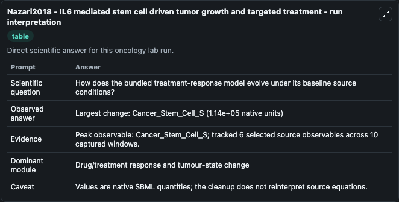
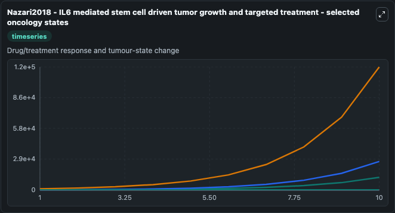
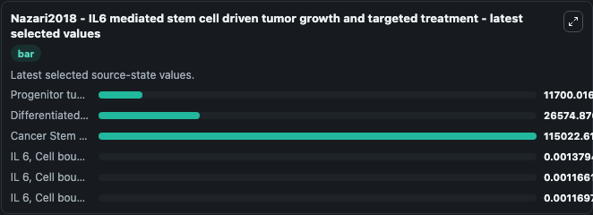

# Nazari2018 - IL6 mediated stem cell driven tumor growth and targeted treatment

This Biosimulant lab wraps `Nazari2018 - IL6 mediated stem cell driven tumor growth and targeted treatment` as a runnable oncology model with a companion visualization module.
This a model from the article: A mathematical model for IL-6-mediated, stem cell driven tumor growth and targeted treatmentFereshteh Nazari, Alexander T. It can be used to explore treatment-response dynamics and compare scenario outcomes across configurations.

## What You'll See

The lab asks: How does the bundled treatment-response model evolve under its baseline source conditions? It runs for 10.0 time units with a communication step of 1.0. The run uses the model defaults declared by the curated SBML wrapper. The generated visualizations focus on Progenitor tumor cell E, Differentiated tumor cell D, Cancer Stem Cell S, IL 6, Cell bound IL 6R complex on S, IL 6, Cell bound IL 6R complex on E, and IL 6, Cell bound IL 6R complex on D, combining trajectory, endpoint-comparison, and summary-table views from one completed dark-mode run.

In this captured run, **Cancer_Stem_Cell_S** carried the largest peak and **Cancer_Stem_Cell_S** moved by **1.14e+05** native units across 10.0 simulation windows.

<!-- BIOSIMULANT_VISUALS_START -->
### Output Visualizations



*Summary table for Nazari2018 - IL6 mediated stem cell driven tumor growth and targeted treatment, reporting the scientific question, observed answer (largest change: **Cancer_Stem_Cell_S** at **1.14e+05** native units), evidence (peak observable: **Cancer_Stem_Cell_S**), dominant module, and caveat.*



*Trajectories of Progenitor tumor cell E, Differentiated tumor cell D, Cancer Stem Cell S, IL 6, Cell bound IL 6R complex on S, IL 6, Cell bound IL 6R complex on E, and IL 6, Cell bound IL 6R complex on D across the 10.0 simulation. In this run **Cancer Stem Cell S** climbed from 1000.0 to 1.15e+05 — the largest movements among the focused observables.*



*Endpoint ranking of the focused observables. Top 3 by final value: **Cancer Stem Cell S** = 1.15e+05, **Differentiated tumor cell D** = 2.66e+04, **Progenitor tumor cell E** = 1.17e+04, with 3 more observables below.*

<!-- BIOSIMULANT_VISUALS_END -->

## Model Context

- Core model: `models/core`
- Visualization model: `models/visualisation`
- Standard: `other`
- Upstream source: `biomodels_ebi:BIOMD0000000819`
- License: `CC0`
- Visual scope: Drug/treatment response and tumour-state change
- Caveat: Values are native SBML quantities; the cleanup does not reinterpret source equations.

## Inputs

| Input | Maps To | Default | Notes |
|---|---|---|---|
| Progenitor tumor cell E | `oncology_sbml_nazari2018_il6_mediated_stem_cell_driven_tumor_g_biomd0000000819_model.initial_progenitor_tumor_cell_e` | `0.01` | Initial Progenitor tumor cell E. Sets the initial value of bundled SBML symbol `Progenitor_tumor_cell_E`. |
| Differentiated tumor cell D | `oncology_sbml_nazari2018_il6_mediated_stem_cell_driven_tumor_g_biomd0000000819_model.initial_differentiated_tumor_cell_d` | `0.01` | Initial Differentiated tumor cell D. Sets the initial value of bundled SBML symbol `Differentiated_tumor_cell_D`. |
| Cancer Stem Cell S | `oncology_sbml_nazari2018_il6_mediated_stem_cell_driven_tumor_g_biomd0000000819_model.initial_cancer_stem_cell_s` | `1000.0` | Initial Cancer Stem Cell S. Sets the initial value of bundled SBML symbol `Cancer_Stem_Cell_S`. |
| IL 6, Cell bound IL 6R complex on S | `oncology_sbml_nazari2018_il6_mediated_stem_cell_driven_tumor_g_biomd0000000819_model.initial_il_6_cell_bound_il_6r_complex_on_s` | `0.0` | Initial IL 6, Cell bound IL 6R complex on S. Sets the initial value of bundled SBML symbol `IL_6__Cell_bound_IL_6R_complex_on_S`. |
| IL 6, Cell bound IL 6R complex on E | `oncology_sbml_nazari2018_il6_mediated_stem_cell_driven_tumor_g_biomd0000000819_model.initial_il_6_cell_bound_il_6r_complex_on_e` | `0.0` | Initial IL 6, Cell bound IL 6R complex on E. Sets the initial value of bundled SBML symbol `IL_6__Cell_bound_IL_6R_complex_on_E`. |
| IL 6, Cell bound IL 6R complex on D | `oncology_sbml_nazari2018_il6_mediated_stem_cell_driven_tumor_g_biomd0000000819_model.initial_il_6_cell_bound_il_6r_complex_on_d` | `0.0` | Initial IL 6, Cell bound IL 6R complex on D. Sets the initial value of bundled SBML symbol `IL_6__Cell_bound_IL_6R_complex_on_D`. |

## Outputs

| Output | Maps To | Role |
|---|---|---|
| `progenitor_tumor_cell_e` | `oncology_sbml_nazari2018_il6_mediated_stem_cell_driven_tumor_g_biomd0000000819_model.progenitor_tumor_cell_e` | Progenitor tumor cell E observable. |
| `differentiated_tumor_cell_d` | `oncology_sbml_nazari2018_il6_mediated_stem_cell_driven_tumor_g_biomd0000000819_model.differentiated_tumor_cell_d` | Differentiated tumor cell D observable. |
| `cancer_stem_cell_s` | `oncology_sbml_nazari2018_il6_mediated_stem_cell_driven_tumor_g_biomd0000000819_model.cancer_stem_cell_s` | Cancer Stem Cell S observable. |
| `il_6_cell_bound_il_6r_complex_on_s` | `oncology_sbml_nazari2018_il6_mediated_stem_cell_driven_tumor_g_biomd0000000819_model.il_6_cell_bound_il_6r_complex_on_s` | IL 6, Cell bound IL 6R complex on S observable. |
| `il_6_cell_bound_il_6r_complex_on_e` | `oncology_sbml_nazari2018_il6_mediated_stem_cell_driven_tumor_g_biomd0000000819_model.il_6_cell_bound_il_6r_complex_on_e` | IL 6, Cell bound IL 6R complex on E observable. |
| `il_6_cell_bound_il_6r_complex_on_d` | `oncology_sbml_nazari2018_il6_mediated_stem_cell_driven_tumor_g_biomd0000000819_model.il_6_cell_bound_il_6r_complex_on_d` | IL 6, Cell bound IL 6R complex on D observable. |
| `state` | `oncology_sbml_nazari2018_il6_mediated_stem_cell_driven_tumor_g_biomd0000000819_model.state` | Full raw SBML observable record for reproducibility and downstream visualisation. |
| `summary` | `oncology_sbml_nazari2018_il6_mediated_stem_cell_driven_tumor_g_biomd0000000819_model.summary` | Change and peak summary across the simulated SBML observables. |
| `species_labels` | `oncology_sbml_nazari2018_il6_mediated_stem_cell_driven_tumor_g_biomd0000000819_model.species_labels` | Mapping from selected raw SBML observable symbols to display labels. |

## Runtime

- Duration: `10.0`
- Communication step: `1.0`

## Running Locally

```bash
biosimulant labs serve .
```
