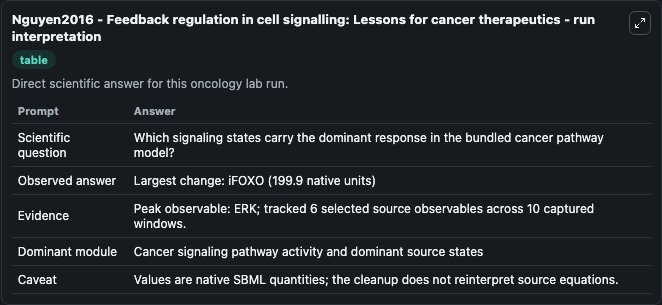
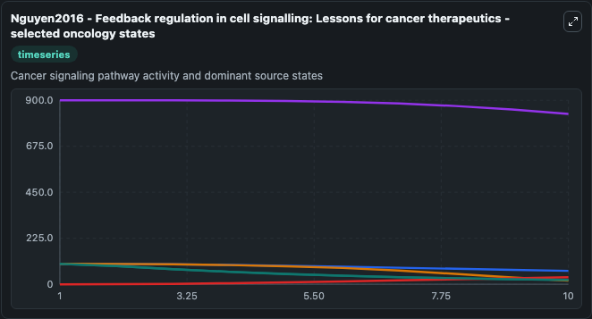
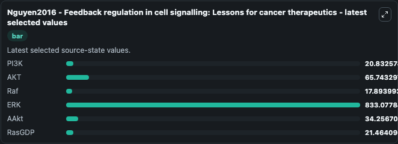

# Nguyen2016 - Feedback regulation in cell signalling: Lessons for cancer therapeutics

This Biosimulant lab wraps `Nguyen2016 - Feedback regulation in cell signalling: Lessons for cancer therapeutics` as a runnable oncology model with a companion visualization module.
Feedback regulation in cell signalling: Lessons for cancer therapeutics This model is described in the article: Feedback regulation in cell signalling: Lessons for cancer therapeutics. It can be used to explore treatment-response dynamics and compare scenario outcomes across configurations.

## What You'll See

The lab asks: Which signaling states carry the dominant response in the bundled cancer pathway model? It runs for 10.0 time units with a communication step of 1.0. The run uses the model defaults declared by the curated SBML wrapper. The generated visualizations focus on PI3K, AKT, Raf, ERK, AAkt, and RasGDP, combining trajectory, endpoint-comparison, and summary-table views from one completed dark-mode run.

In this captured run, **ERK** peaked at **900.0** and **iFOXO** moved by **199.9** native units across 10.0 simulation windows.

<!-- BIOSIMULANT_VISUALS_START -->
### Output Visualizations



*Summary table for Nguyen2016 - Feedback regulation in cell signalling: Lessons for cancer therapeutics, reporting the scientific question, observed answer (largest change: **iFOXO** at **199.9** native units), evidence (peak observable: **ERK**), dominant module, and caveat.*



*Trajectories of PI3K, AKT, Raf, ERK, AAkt, and RasGDP across the 10.0 simulation. In this run **AAkt** climbed from 0 to 34.257 and **Raf** fell from 100.0 to 17.894 — the largest movements among the focused observables.*



*Endpoint ranking of the focused observables. Top 3 by final value: **ERK** = 833.1, **AKT** = 65.743, **AAkt** = 34.257, with 3 more observables below.*

<!-- BIOSIMULANT_VISUALS_END -->

## Model Context

- Core model: `models/core`
- Visualization model: `models/visualisation`
- Standard: `other`
- Upstream source: `biomodels_ebi:BIOMD0000000651`
- License: `CC0`
- Visual scope: Cancer signaling pathway activity and dominant source states
- Caveat: Values are native SBML quantities; the cleanup does not reinterpret source equations.

## Inputs

| Input | Maps To | Default | Notes |
|---|---|---|---|
| PI3K | `oncology_sbml_nguyen2016_feedback_regulation_in_cell_signallin_biomd0000000651_model.initial_pi3k` | `100.0` | Initial PI3K. Sets the initial value of bundled SBML symbol `PI3K`. |
| AKT | `oncology_sbml_nguyen2016_feedback_regulation_in_cell_signallin_biomd0000000651_model.initial_akt` | `100.0` | Initial AKT. Sets the initial value of bundled SBML symbol `Akt`. |
| Raf | `oncology_sbml_nguyen2016_feedback_regulation_in_cell_signallin_biomd0000000651_model.initial_raf` | `100.0` | Initial Raf. Sets the initial value of bundled SBML symbol `Raf`. |
| ERK | `oncology_sbml_nguyen2016_feedback_regulation_in_cell_signallin_biomd0000000651_model.initial_erk` | `899.999999999996` | Initial ERK. Sets the initial value of bundled SBML symbol `ERK`. |
| AAkt | `oncology_sbml_nguyen2016_feedback_regulation_in_cell_signallin_biomd0000000651_model.initial_aakt` | `0.0` | Initial AAkt. Sets the initial value of bundled SBML symbol `aAkt`. |
| RasGDP | `oncology_sbml_nguyen2016_feedback_regulation_in_cell_signallin_biomd0000000651_model.initial_rasgdp` | `100.0` | Initial RasGDP. Sets the initial value of bundled SBML symbol `RasGDP`. |

## Outputs

| Output | Maps To | Role |
|---|---|---|
| `pi3k` | `oncology_sbml_nguyen2016_feedback_regulation_in_cell_signallin_biomd0000000651_model.pi3k` | PI3K observable. |
| `akt` | `oncology_sbml_nguyen2016_feedback_regulation_in_cell_signallin_biomd0000000651_model.akt` | AKT observable. |
| `raf` | `oncology_sbml_nguyen2016_feedback_regulation_in_cell_signallin_biomd0000000651_model.raf` | Raf observable. |
| `erk` | `oncology_sbml_nguyen2016_feedback_regulation_in_cell_signallin_biomd0000000651_model.erk` | ERK observable. |
| `aakt` | `oncology_sbml_nguyen2016_feedback_regulation_in_cell_signallin_biomd0000000651_model.aakt` | AAkt observable. |
| `rasgdp` | `oncology_sbml_nguyen2016_feedback_regulation_in_cell_signallin_biomd0000000651_model.rasgdp` | RasGDP observable. |
| `state` | `oncology_sbml_nguyen2016_feedback_regulation_in_cell_signallin_biomd0000000651_model.state` | Full raw SBML observable record for reproducibility and downstream visualisation. |
| `summary` | `oncology_sbml_nguyen2016_feedback_regulation_in_cell_signallin_biomd0000000651_model.summary` | Change and peak summary across the simulated SBML observables. |
| `species_labels` | `oncology_sbml_nguyen2016_feedback_regulation_in_cell_signallin_biomd0000000651_model.species_labels` | Mapping from selected raw SBML observable symbols to display labels. |

## Runtime

- Duration: `10.0`
- Communication step: `1.0`

## Running Locally

```bash
biosimulant labs serve .
```
