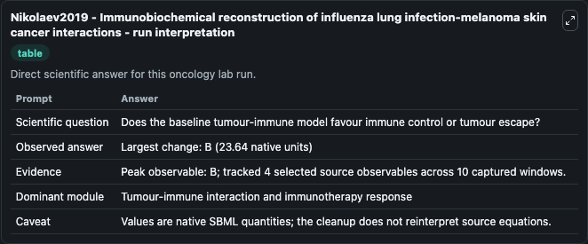
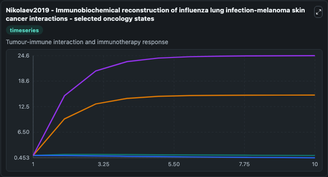
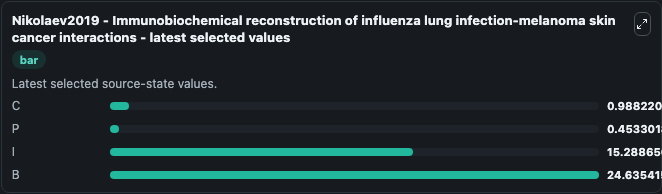

# Nikolaev2019 - Immunobiochemical reconstruction of influenza lung infection-melanoma skin cancer interactions

This Biosimulant lab wraps `Nikolaev2019 - Immunobiochemical reconstruction of influenza lung infection-melanoma skin cancer interactions` as a runnable oncology model with a companion visualization module.
This is a mathematical mechanistic immunobiochemical model that incorporates T cell pathways that control programmed cell death protein 1 (PD-1) expression. It can be used to explore treatment-response dynamics and compare scenario outcomes across configurations.

## What You'll See

The lab asks: Does the baseline tumour-immune model favour immune control or tumour escape? It runs for 10.0 time units with a communication step of 1.0. The run uses the model defaults declared by the curated SBML wrapper. The generated visualizations focus on C, P, I, and B, combining trajectory, endpoint-comparison, and summary-table views from one completed dark-mode run.

In this captured run, **B** peaked at **24.635** and **B** moved by **23.640** native units across 10.0 simulation windows.

<!-- BIOSIMULANT_VISUALS_START -->
### Output Visualizations



*Summary table for Nikolaev2019 - Immunobiochemical reconstruction of influenza lung infection-melanoma skin cancer interactions, reporting the scientific question, observed answer (largest change: **B** at **23.640** native units), evidence (peak observable: **B**), dominant module, and caveat.*



*Trajectories of C, P, I, and B across the 10.0 simulation. In this run **B** climbed from 1.000 to 24.635 and **P** fell from 1.000 to 0.4533 — the largest movements among the focused observables.*



*Endpoint ranking of the focused observables. Top 3 by final value: **B** = 24.635, **I** = 15.289, **C** = 0.9882, with 1 more observable below.*

<!-- BIOSIMULANT_VISUALS_END -->

## Model Context

- Core model: `models/core`
- Visualization model: `models/visualisation`
- Standard: `other`
- Upstream source: `biomodels_ebi:BIOMD0000000865`
- License: `CC0`
- Visual scope: Tumour-immune interaction and immunotherapy response
- Caveat: Values are native SBML quantities; the cleanup does not reinterpret source equations.

## Inputs

| Input | Maps To | Default | Notes |
|---|---|---|---|
| Sigma p tilde source parameter | `oncology_sbml_nikolaev2019_immunobiochemical_reconstruction_of_biomd0000000865_model.sigma_p_tilde_level` | `0.1` | Sigma p tilde source parameter. Maps to bundled SBML parameter `sigma_p_tilde`. |

## Outputs

| Output | Maps To | Role |
|---|---|---|
| `model_state_1` | `oncology_sbml_nikolaev2019_immunobiochemical_reconstruction_of_biomd0000000865_model.model_state_1` | C observable. |
| `model_state_2` | `oncology_sbml_nikolaev2019_immunobiochemical_reconstruction_of_biomd0000000865_model.model_state_2` | P observable. |
| `model_state_3` | `oncology_sbml_nikolaev2019_immunobiochemical_reconstruction_of_biomd0000000865_model.model_state_3` | I observable. |
| `model_state_4` | `oncology_sbml_nikolaev2019_immunobiochemical_reconstruction_of_biomd0000000865_model.model_state_4` | B observable. |
| `state` | `oncology_sbml_nikolaev2019_immunobiochemical_reconstruction_of_biomd0000000865_model.state` | Full raw SBML observable record for reproducibility and downstream visualisation. |
| `summary` | `oncology_sbml_nikolaev2019_immunobiochemical_reconstruction_of_biomd0000000865_model.summary` | Change and peak summary across the simulated SBML observables. |
| `species_labels` | `oncology_sbml_nikolaev2019_immunobiochemical_reconstruction_of_biomd0000000865_model.species_labels` | Mapping from selected raw SBML observable symbols to display labels. |

## Runtime

- Duration: `10.0`
- Communication step: `1.0`

## Running Locally

```bash
biosimulant labs serve .
```
