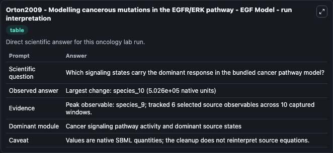
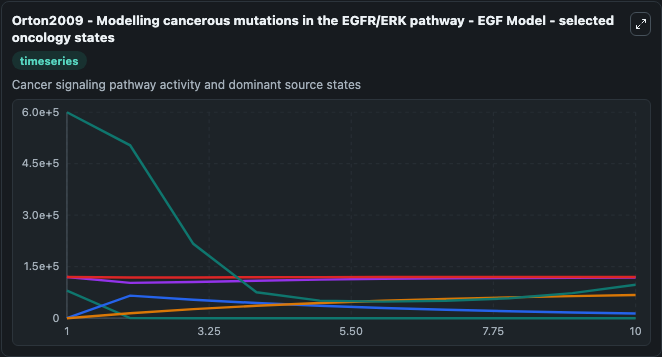
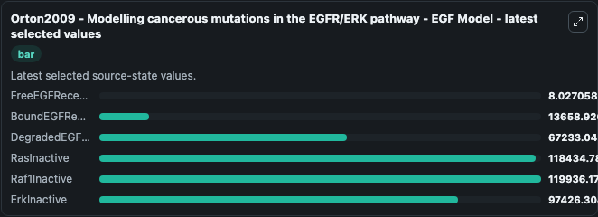

# Orton2009 - Modelling cancerous mutations in the EGFR/ERK pathway - EGF Model

This Biosimulant lab wraps `Orton2009 - Modelling cancerous mutations in the EGFR/ERK pathway - EGF Model` as a runnable oncology model with a companion visualization module.
Orton2009 - Modelling cancerous mutations inthe EGFR/ERK pathway - EGF Model This model studies the aberrations inERK signalling for different cancer mutations. It can be used to explore treatment-response dynamics and compare scenario outcomes across configurations.

## What You'll See

The lab asks: Which signaling states carry the dominant response in the bundled cancer pathway model? It runs for 10.0 time units with a communication step of 1.0. The run uses the model defaults declared by the curated SBML wrapper. The generated visualizations focus on FreeEGFReceptor, BoundEGFReceptor, DegradedEGFReceptor, RasInactive, Raf1Inactive, and ErkInactive, combining trajectory, endpoint-comparison, and summary-table views from one completed dark-mode run.

In this captured run, **species_9** carried the largest peak and **species_10** moved by **5.03e+05** native units across 10.0 simulation windows.

<!-- BIOSIMULANT_VISUALS_START -->
### Output Visualizations



*Summary table for Orton2009 - Modelling cancerous mutations in the EGFR/ERK pathway - EGF Model, reporting the scientific question, observed answer (largest change: **species_10** at **5.03e+05** native units), evidence (peak observable: **species_9**), dominant module, and caveat.*



*Trajectories of FreeEGFReceptor, BoundEGFReceptor, DegradedEGFReceptor, RasInactive, Raf1Inactive, and ErkInactive across the 10.0 simulation. In this run **DegradedEGFReceptor** climbed from 0 to 6.72e+04 and **ErkInactive** fell from 6e+05 to 9.74e+04 — the largest movements among the focused observables.*



*Endpoint ranking of the focused observables. Top 3 by final value: **Raf1Inactive** = 1.2e+05, **RasInactive** = 1.18e+05, **ErkInactive** = 9.74e+04, with 3 more observables below.*

<!-- BIOSIMULANT_VISUALS_END -->

## Model Context

- Core model: `models/core`
- Visualization model: `models/visualisation`
- Standard: `other`
- Upstream source: `biomodels_ebi:BIOMD0000000623`
- License: `CC0`
- Visual scope: Cancer signaling pathway activity and dominant source states
- Caveat: Values are native SBML quantities; the cleanup does not reinterpret source equations.

## Inputs

| Input | Maps To | Default | Notes |
|---|---|---|---|
| FreeEGFReceptor | `oncology_sbml_orton2009_modelling_cancerous_mutations_in_the_e_biomd0000000623_model.initial_freeegfreceptor` | `80000.0` | Initial FreeEGFReceptor. Sets the initial value of bundled SBML symbol `species_1`. |
| BoundEGFReceptor | `oncology_sbml_orton2009_modelling_cancerous_mutations_in_the_e_biomd0000000623_model.initial_boundegfreceptor` | `0.0` | Initial BoundEGFReceptor. Sets the initial value of bundled SBML symbol `species_0`. |
| DegradedEGFReceptor | `oncology_sbml_orton2009_modelling_cancerous_mutations_in_the_e_biomd0000000623_model.initial_degradedegfreceptor` | `0.0` | Initial DegradedEGFReceptor. Sets the initial value of bundled SBML symbol `species_18`. |
| RasInactive | `oncology_sbml_orton2009_modelling_cancerous_mutations_in_the_e_biomd0000000623_model.initial_rasinactive` | `120000.0` | Initial RasInactive. Sets the initial value of bundled SBML symbol `species_5`. |
| Raf1Inactive | `oncology_sbml_orton2009_modelling_cancerous_mutations_in_the_e_biomd0000000623_model.initial_raf1inactive` | `120000.0` | Initial Raf1Inactive. Sets the initial value of bundled SBML symbol `species_7`. |
| ErkInactive | `oncology_sbml_orton2009_modelling_cancerous_mutations_in_the_e_biomd0000000623_model.initial_erkinactive` | `600000.0` | Initial ErkInactive. Sets the initial value of bundled SBML symbol `species_11`. |

## Outputs

| Output | Maps To | Role |
|---|---|---|
| `freeegfreceptor` | `oncology_sbml_orton2009_modelling_cancerous_mutations_in_the_e_biomd0000000623_model.freeegfreceptor` | FreeEGFReceptor observable. |
| `boundegfreceptor` | `oncology_sbml_orton2009_modelling_cancerous_mutations_in_the_e_biomd0000000623_model.boundegfreceptor` | BoundEGFReceptor observable. |
| `degradedegfreceptor` | `oncology_sbml_orton2009_modelling_cancerous_mutations_in_the_e_biomd0000000623_model.degradedegfreceptor` | DegradedEGFReceptor observable. |
| `rasinactive` | `oncology_sbml_orton2009_modelling_cancerous_mutations_in_the_e_biomd0000000623_model.rasinactive` | RasInactive observable. |
| `raf1inactive` | `oncology_sbml_orton2009_modelling_cancerous_mutations_in_the_e_biomd0000000623_model.raf1inactive` | Raf1Inactive observable. |
| `erkinactive` | `oncology_sbml_orton2009_modelling_cancerous_mutations_in_the_e_biomd0000000623_model.erkinactive` | ErkInactive observable. |
| `state` | `oncology_sbml_orton2009_modelling_cancerous_mutations_in_the_e_biomd0000000623_model.state` | Full raw SBML observable record for reproducibility and downstream visualisation. |
| `summary` | `oncology_sbml_orton2009_modelling_cancerous_mutations_in_the_e_biomd0000000623_model.summary` | Change and peak summary across the simulated SBML observables. |
| `species_labels` | `oncology_sbml_orton2009_modelling_cancerous_mutations_in_the_e_biomd0000000623_model.species_labels` | Mapping from selected raw SBML observable symbols to display labels. |

## Runtime

- Duration: `10.0`
- Communication step: `1.0`

## Running Locally

```bash
biosimulant labs serve .
```
