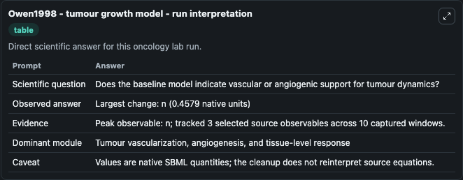
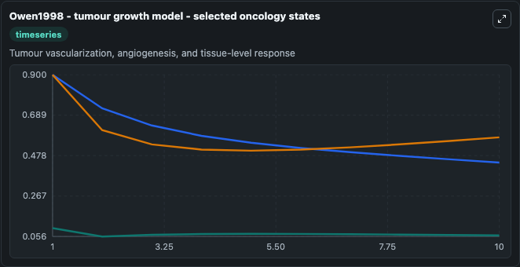
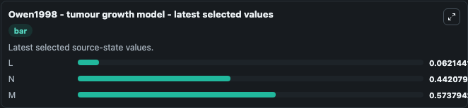

# Owen1998 - tumour growth model

This Biosimulant lab wraps `Owen1998 - tumour growth model` as a runnable oncology model with a companion visualization module.
Owen1998 - tumour growth model Deterministic model for the early,avascular growth of a tumour, concentrating on the inhibitoryeffect of macrophages. It can be used to explore treatment-response dynamics and compare scenario outcomes across configurations.

## What You'll See

The lab asks: Does the baseline model indicate vascular or angiogenic support for tumour dynamics? It runs for 10.0 time units with a communication step of 1.0. The run uses the model defaults declared by the curated SBML wrapper. The generated visualizations focus on L, N, and M, combining trajectory, endpoint-comparison, and summary-table views from one completed dark-mode run.

In this captured run, **n** carried the largest peak and **n** moved by **0.4579** native units across 10.0 simulation windows.

<!-- BIOSIMULANT_VISUALS_START -->
### Output Visualizations



*Summary table for Owen1998 - tumour growth model, reporting the scientific question, observed answer (largest change: **n** at **0.4579** native units), evidence (peak observable: **n**), dominant module, and caveat.*



*Trajectories of L, N, and M across the 10.0 simulation. In this run **N** fell from 0.9000 to 0.4421 — the largest movements among the focused observables.*



*Endpoint ranking of the focused observables. Top 3 by final value: **M** = 0.5738, **N** = 0.4421, **L** = 0.0621.*

<!-- BIOSIMULANT_VISUALS_END -->

## Model Context

- Core model: `models/core`
- Visualization model: `models/visualisation`
- Standard: `other`
- Upstream source: `biomodels_ebi:BIOMD0000000670`
- License: `CC0`
- Visual scope: Tumour vascularization, angiogenesis, and tissue-level response
- Caveat: Values are native SBML quantities; the cleanup does not reinterpret source equations.

## Inputs

| Input | Maps To | Default | Notes |
|---|---|---|---|

## Outputs

| Output | Maps To | Role |
|---|---|---|
| `model_state_1` | `oncology_sbml_owen1998_tumour_growth_model_biomd0000000670_model.model_state_1` | L observable. |
| `model_state_2` | `oncology_sbml_owen1998_tumour_growth_model_biomd0000000670_model.model_state_2` | N observable. |
| `model_state_3` | `oncology_sbml_owen1998_tumour_growth_model_biomd0000000670_model.model_state_3` | M observable. |
| `state` | `oncology_sbml_owen1998_tumour_growth_model_biomd0000000670_model.state` | Full raw SBML observable record for reproducibility and downstream visualisation. |
| `summary` | `oncology_sbml_owen1998_tumour_growth_model_biomd0000000670_model.summary` | Change and peak summary across the simulated SBML observables. |
| `species_labels` | `oncology_sbml_owen1998_tumour_growth_model_biomd0000000670_model.species_labels` | Mapping from selected raw SBML observable symbols to display labels. |

## Runtime

- Duration: `10.0`
- Communication step: `1.0`

## Running Locally

```bash
biosimulant labs serve .
```
