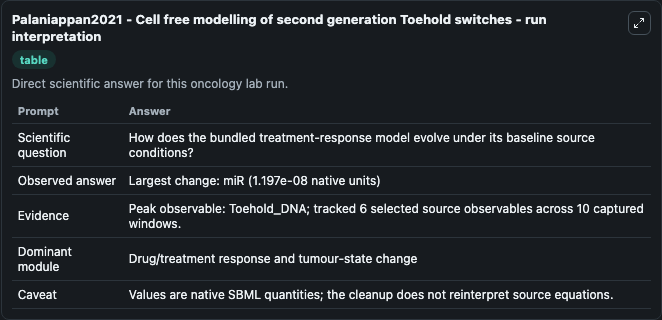
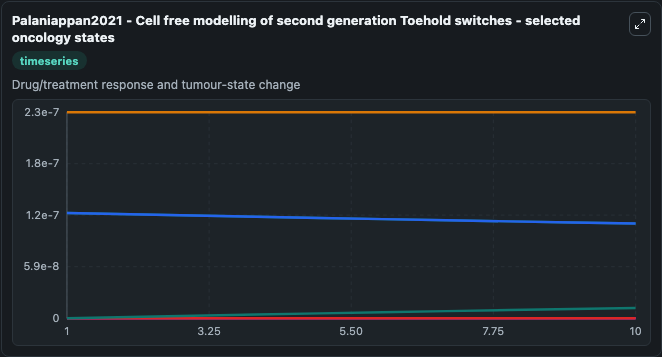
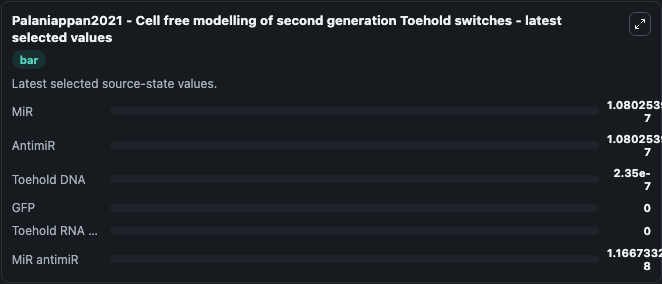

# Palaniappan2021 - Cell free modelling of second generation Toehold switches

This Biosimulant lab wraps `Palaniappan2021 - Cell free modelling of second generation Toehold switches` as a runnable oncology model with a companion visualization module.
Cervical cancer is a global public health subject as it affects women in the reproductive ages, and accounts for the second largest burden among cancer patients worldwide with an unforgiving 50% morta. It can be used to explore treatment-response dynamics and compare scenario outcomes across configurations.

## What You'll See

The lab asks: How does the bundled treatment-response model evolve under its baseline source conditions? It runs for 10.0 time units with a communication step of 1.0. The run uses the model defaults declared by the curated SBML wrapper. The generated visualizations focus on MiR, AntimiR, Toehold DNA, GFP, Toehold RNA CTS, and MiR antimiR, combining trajectory, endpoint-comparison, and summary-table views from one completed dark-mode run.

In this captured run, **Toehold_DNA** carried the largest peak and **miR** moved by **1.2e-08** native units across 10.0 simulation windows.

<!-- BIOSIMULANT_VISUALS_START -->
### Output Visualizations



*Summary table for Palaniappan2021 - Cell free modelling of second generation Toehold switches, reporting the scientific question, observed answer (largest change: **miR** at **1.2e-08** native units), evidence (peak observable: **Toehold_DNA**), dominant module, and caveat.*



*Trajectories of MiR, AntimiR, Toehold DNA, GFP, Toehold RNA CTS, and MiR antimiR across the 10.0 simulation. In this run **MiR antimiR** climbed from 0 to 1.17e-08 and **MiR** fell from 1.2e-07 to 1.08e-07 — the largest movements among the focused observables.*



*Endpoint ranking of the focused observables. Top 3 by final value: **Toehold DNA** = 2.35e-07, **MiR** = 1.08e-07, **AntimiR** = 1.08e-07, with 3 more observables below.*

<!-- BIOSIMULANT_VISUALS_END -->

## Model Context

- Core model: `models/core`
- Visualization model: `models/visualisation`
- Standard: `other`
- Upstream source: `biomodels_ebi:BIOMD0000001103`
- License: `CC0`
- Visual scope: Drug/treatment response and tumour-state change
- Caveat: Values are native SBML quantities; the cleanup does not reinterpret source equations.

## Inputs

| Input | Maps To | Default | Notes |
|---|---|---|---|
| MiR | `oncology_sbml_palaniappan2021_cell_free_modelling_of_second_ge_biomd0000001103_model.initial_mir` | `1.2e-07` | Initial MiR. Sets the initial value of bundled SBML symbol `miR`. |
| AntimiR | `oncology_sbml_palaniappan2021_cell_free_modelling_of_second_ge_biomd0000001103_model.initial_antimir` | `1.2e-07` | Initial AntimiR. Sets the initial value of bundled SBML symbol `antimiR`. |
| Toehold DNA | `oncology_sbml_palaniappan2021_cell_free_modelling_of_second_ge_biomd0000001103_model.initial_toehold_dna` | `2.35e-07` | Initial Toehold DNA. Sets the initial value of bundled SBML symbol `Toehold_DNA`. |
| GFP | `oncology_sbml_palaniappan2021_cell_free_modelling_of_second_ge_biomd0000001103_model.initial_gfp` | `0.0` | Initial GFP. Sets the initial value of bundled SBML symbol `GFP`. |
| Toehold RNA CTS | `oncology_sbml_palaniappan2021_cell_free_modelling_of_second_ge_biomd0000001103_model.initial_toehold_rna_cts` | `0.0` | Initial Toehold RNA CTS. Sets the initial value of bundled SBML symbol `Toehold_RNA_CTS`. |
| MiR antimiR | `oncology_sbml_palaniappan2021_cell_free_modelling_of_second_ge_biomd0000001103_model.initial_mir_antimir` | `0.0` | Initial MiR antimiR. Sets the initial value of bundled SBML symbol `miR_antimiR`. |

## Outputs

| Output | Maps To | Role |
|---|---|---|
| `mir` | `oncology_sbml_palaniappan2021_cell_free_modelling_of_second_ge_biomd0000001103_model.mir` | MiR observable. |
| `antimir` | `oncology_sbml_palaniappan2021_cell_free_modelling_of_second_ge_biomd0000001103_model.antimir` | AntimiR observable. |
| `toehold_dna` | `oncology_sbml_palaniappan2021_cell_free_modelling_of_second_ge_biomd0000001103_model.toehold_dna` | Toehold DNA observable. |
| `gfp` | `oncology_sbml_palaniappan2021_cell_free_modelling_of_second_ge_biomd0000001103_model.gfp` | GFP observable. |
| `toehold_rna_cts` | `oncology_sbml_palaniappan2021_cell_free_modelling_of_second_ge_biomd0000001103_model.toehold_rna_cts` | Toehold RNA CTS observable. |
| `mir_antimir` | `oncology_sbml_palaniappan2021_cell_free_modelling_of_second_ge_biomd0000001103_model.mir_antimir` | MiR antimiR observable. |
| `state` | `oncology_sbml_palaniappan2021_cell_free_modelling_of_second_ge_biomd0000001103_model.state` | Full raw SBML observable record for reproducibility and downstream visualisation. |
| `summary` | `oncology_sbml_palaniappan2021_cell_free_modelling_of_second_ge_biomd0000001103_model.summary` | Change and peak summary across the simulated SBML observables. |
| `species_labels` | `oncology_sbml_palaniappan2021_cell_free_modelling_of_second_ge_biomd0000001103_model.species_labels` | Mapping from selected raw SBML observable symbols to display labels. |

## Runtime

- Duration: `10.0`
- Communication step: `1.0`

## Running Locally

```bash
biosimulant labs serve .
```
