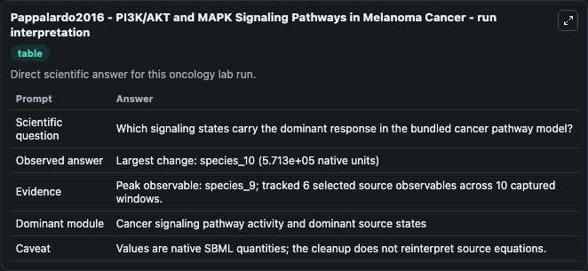
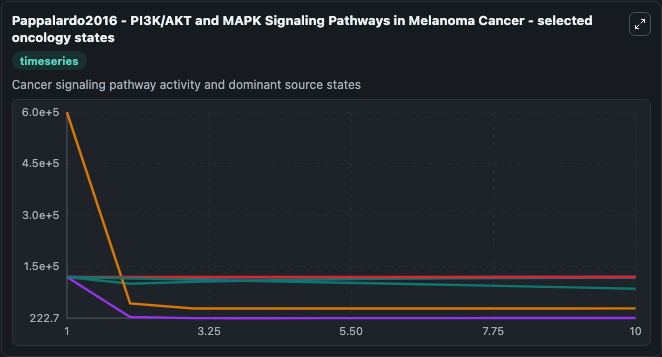
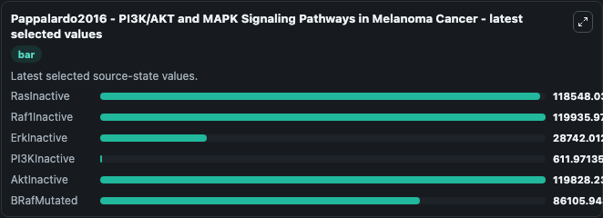

# Pappalardo2016 - PI3K/AKT and MAPK Signaling Pathways in Melanoma Cancer

This Biosimulant lab wraps `Pappalardo2016 - PI3K/AKT and MAPK Signaling Pathways in Melanoma Cancer` as a runnable oncology model with a companion visualization module.
Pappalardo2016 - PI3K/AKT and MAPK SignalingPathways in Melanoma Cancer This model is described in the article: Computational Modeling of PI3K/AKT and MAPK Signaling Pathways in Melanoma Cancer. It can be used to explore treatment-response dynamics and compare scenario outcomes across configurations.

## What You'll See

The lab asks: Which signaling states carry the dominant response in the bundled cancer pathway model? It runs for 10.0 time units with a communication step of 1.0. The run uses the model defaults declared by the curated SBML wrapper. The generated visualizations focus on RasInactive, Raf1Inactive, ErkInactive, PI3KInactive, AktInactive, and BRafMutated, combining trajectory, endpoint-comparison, and summary-table views from one completed dark-mode run.

In this captured run, **species_9** carried the largest peak and **species_10** moved by **5.71e+05** native units across 10.0 simulation windows.

<!-- BIOSIMULANT_VISUALS_START -->
### Output Visualizations



*Summary table for Pappalardo2016 - PI3K/AKT and MAPK Signaling Pathways in Melanoma Cancer, reporting the scientific question, observed answer (largest change: **species_10** at **5.71e+05** native units), evidence (peak observable: **species_9**), dominant module, and caveat.*



*Trajectories of RasInactive, Raf1Inactive, ErkInactive, PI3KInactive, AktInactive, and BRafMutated across the 10.0 simulation. In this run **ErkInactive** fell from 6e+05 to 2.87e+04 — the largest movements among the focused observables.*



*Endpoint ranking of the focused observables. Top 3 by final value: **Raf1Inactive** = 1.2e+05, **AktInactive** = 1.2e+05, **RasInactive** = 1.19e+05, with 3 more observables below.*

<!-- BIOSIMULANT_VISUALS_END -->

## Model Context

- Core model: `models/core`
- Visualization model: `models/visualisation`
- Standard: `other`
- Upstream source: `biomodels_ebi:BIOMD0000000666`
- License: `CC0`
- Visual scope: Cancer signaling pathway activity and dominant source states
- Caveat: Values are native SBML quantities; the cleanup does not reinterpret source equations.

## Inputs

| Input | Maps To | Default | Notes |
|---|---|---|---|
| RasInactive | `oncology_sbml_pappalardo2016_pi3k_akt_and_mapk_signaling_pathw_biomd0000000666_model.initial_rasinactive` | `120000.0` | Initial RasInactive. Sets the initial value of bundled SBML symbol `species_5`. |
| Raf1Inactive | `oncology_sbml_pappalardo2016_pi3k_akt_and_mapk_signaling_pathw_biomd0000000666_model.initial_raf1inactive` | `120000.0` | Initial Raf1Inactive. Sets the initial value of bundled SBML symbol `species_7`. |
| ErkInactive | `oncology_sbml_pappalardo2016_pi3k_akt_and_mapk_signaling_pathw_biomd0000000666_model.initial_erkinactive` | `600000.0` | Initial ErkInactive. Sets the initial value of bundled SBML symbol `species_11`. |
| PI3KInactive | `oncology_sbml_pappalardo2016_pi3k_akt_and_mapk_signaling_pathw_biomd0000000666_model.initial_pi3kinactive` | `120000.0` | Initial PI3KInactive. Sets the initial value of bundled SBML symbol `species_15`. |
| AktInactive | `oncology_sbml_pappalardo2016_pi3k_akt_and_mapk_signaling_pathw_biomd0000000666_model.initial_aktinactive` | `120000.0` | Initial AktInactive. Sets the initial value of bundled SBML symbol `species_17`. |
| BRafMutated | `oncology_sbml_pappalardo2016_pi3k_akt_and_mapk_signaling_pathw_biomd0000000666_model.initial_brafmutated` | `120000.0` | Initial BRafMutated. Sets the initial value of bundled SBML symbol `bRafMutated`. |

## Outputs

| Output | Maps To | Role |
|---|---|---|
| `rasinactive` | `oncology_sbml_pappalardo2016_pi3k_akt_and_mapk_signaling_pathw_biomd0000000666_model.rasinactive` | RasInactive observable. |
| `raf1inactive` | `oncology_sbml_pappalardo2016_pi3k_akt_and_mapk_signaling_pathw_biomd0000000666_model.raf1inactive` | Raf1Inactive observable. |
| `erkinactive` | `oncology_sbml_pappalardo2016_pi3k_akt_and_mapk_signaling_pathw_biomd0000000666_model.erkinactive` | ErkInactive observable. |
| `pi3kinactive` | `oncology_sbml_pappalardo2016_pi3k_akt_and_mapk_signaling_pathw_biomd0000000666_model.pi3kinactive` | PI3KInactive observable. |
| `aktinactive` | `oncology_sbml_pappalardo2016_pi3k_akt_and_mapk_signaling_pathw_biomd0000000666_model.aktinactive` | AktInactive observable. |
| `brafmutated` | `oncology_sbml_pappalardo2016_pi3k_akt_and_mapk_signaling_pathw_biomd0000000666_model.brafmutated` | BRafMutated observable. |
| `state` | `oncology_sbml_pappalardo2016_pi3k_akt_and_mapk_signaling_pathw_biomd0000000666_model.state` | Full raw SBML observable record for reproducibility and downstream visualisation. |
| `summary` | `oncology_sbml_pappalardo2016_pi3k_akt_and_mapk_signaling_pathw_biomd0000000666_model.summary` | Change and peak summary across the simulated SBML observables. |
| `species_labels` | `oncology_sbml_pappalardo2016_pi3k_akt_and_mapk_signaling_pathw_biomd0000000666_model.species_labels` | Mapping from selected raw SBML observable symbols to display labels. |

## Runtime

- Duration: `10.0`
- Communication step: `1.0`

## Running Locally

```bash
biosimulant labs serve .
```
