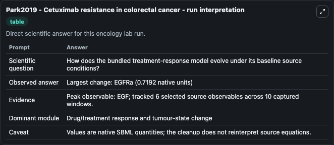
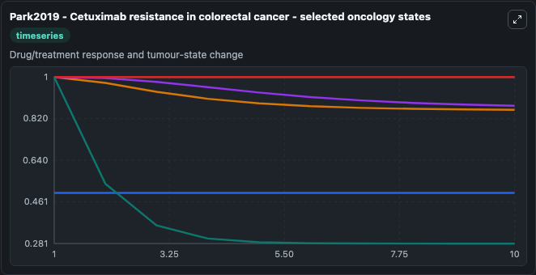
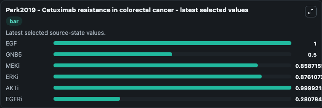

# Park2019 - Cetuximab resistance in colorectal cancer

This Biosimulant lab wraps `Park2019 - Cetuximab resistance in colorectal cancer` as a runnable oncology model with a companion visualization module.
It's an experimental + mathematical paper explaining probable targets for Cetixumab resistance in colorectal cancer. It can be used to explore treatment-response dynamics and compare scenario outcomes across configurations.

## What You'll See

The lab asks: How does the bundled treatment-response model evolve under its baseline source conditions? It runs for 10.0 time units with a communication step of 1.0. The run uses the model defaults declared by the curated SBML wrapper. The generated visualizations focus on EGF, GNB5, MEKi, ERKi, AKTi, and EGFRi, combining trajectory, endpoint-comparison, and summary-table views from one completed dark-mode run.

In this captured run, **EGF** peaked at **1.000** and **EGFRa** moved by **0.7192** native units across 10.0 simulation windows.

<!-- BIOSIMULANT_VISUALS_START -->
### Output Visualizations



*Summary table for Park2019 - Cetuximab resistance in colorectal cancer, reporting the scientific question, observed answer (largest change: **EGFRa** at **0.7192** native units), evidence (peak observable: **EGF**), dominant module, and caveat.*



*Trajectories of EGF, GNB5, MEKi, ERKi, AKTi, and EGFRi across the 10.0 simulation. In this run **EGFRi** fell from 1.000 to 0.2808 — the largest movements among the focused observables.*



*Endpoint ranking of the focused observables. Top 3 by final value: **EGF** = 1.000, **AKTi** = 0.9999, **ERKi** = 0.8761, with 3 more observables below.*

<!-- BIOSIMULANT_VISUALS_END -->

## Model Context

- Core model: `models/core`
- Visualization model: `models/visualisation`
- Standard: `other`
- Upstream source: `biomodels_ebi:MODEL1909300004`
- License: `CC0`
- Visual scope: Drug/treatment response and tumour-state change
- Caveat: Values are native SBML quantities; the cleanup does not reinterpret source equations.

## Inputs

| Input | Maps To | Default | Notes |
|---|---|---|---|
| EGF | `oncology_sbml_park2019_cetuximab_resistance_in_colorectal_canc_model1909300004_model.initial_egf` | `1.0` | Initial EGF. Sets the initial value of bundled SBML symbol `EGF`. |
| GNB5 | `oncology_sbml_park2019_cetuximab_resistance_in_colorectal_canc_model1909300004_model.initial_gnb5` | `0.5` | Initial GNB5. Sets the initial value of bundled SBML symbol `GNB5`. |
| MEKi | `oncology_sbml_park2019_cetuximab_resistance_in_colorectal_canc_model1909300004_model.initial_meki` | `1.0` | Initial MEKi. Sets the initial value of bundled SBML symbol `MEKi`. |
| ERKi | `oncology_sbml_park2019_cetuximab_resistance_in_colorectal_canc_model1909300004_model.initial_erki` | `1.0` | Initial ERKi. Sets the initial value of bundled SBML symbol `ERKi`. |
| AKTi | `oncology_sbml_park2019_cetuximab_resistance_in_colorectal_canc_model1909300004_model.initial_akti` | `1.0` | Initial AKTi. Sets the initial value of bundled SBML symbol `AKTi`. |
| EGFRi | `oncology_sbml_park2019_cetuximab_resistance_in_colorectal_canc_model1909300004_model.initial_egfri` | `1.0` | Initial EGFRi. Sets the initial value of bundled SBML symbol `EGFRi`. |

## Outputs

| Output | Maps To | Role |
|---|---|---|
| `egf` | `oncology_sbml_park2019_cetuximab_resistance_in_colorectal_canc_model1909300004_model.egf` | EGF observable. |
| `gnb5` | `oncology_sbml_park2019_cetuximab_resistance_in_colorectal_canc_model1909300004_model.gnb5` | GNB5 observable. |
| `meki` | `oncology_sbml_park2019_cetuximab_resistance_in_colorectal_canc_model1909300004_model.meki` | MEKi observable. |
| `erki` | `oncology_sbml_park2019_cetuximab_resistance_in_colorectal_canc_model1909300004_model.erki` | ERKi observable. |
| `akti` | `oncology_sbml_park2019_cetuximab_resistance_in_colorectal_canc_model1909300004_model.akti` | AKTi observable. |
| `egfri` | `oncology_sbml_park2019_cetuximab_resistance_in_colorectal_canc_model1909300004_model.egfri` | EGFRi observable. |
| `state` | `oncology_sbml_park2019_cetuximab_resistance_in_colorectal_canc_model1909300004_model.state` | Full raw SBML observable record for reproducibility and downstream visualisation. |
| `summary` | `oncology_sbml_park2019_cetuximab_resistance_in_colorectal_canc_model1909300004_model.summary` | Change and peak summary across the simulated SBML observables. |
| `species_labels` | `oncology_sbml_park2019_cetuximab_resistance_in_colorectal_canc_model1909300004_model.species_labels` | Mapping from selected raw SBML observable symbols to display labels. |

## Runtime

- Duration: `10.0`
- Communication step: `1.0`

## Running Locally

```bash
biosimulant labs serve .
```
