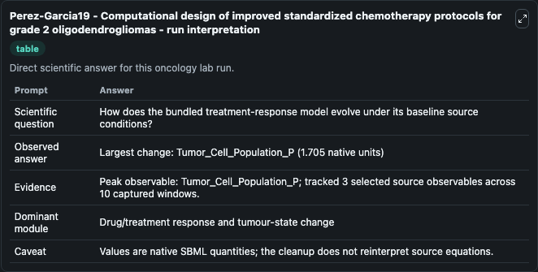
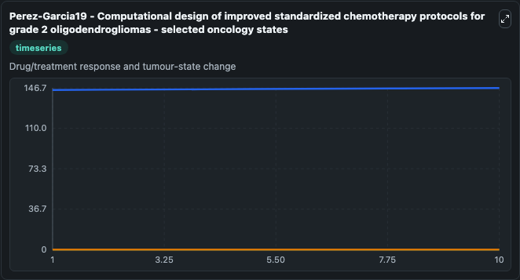
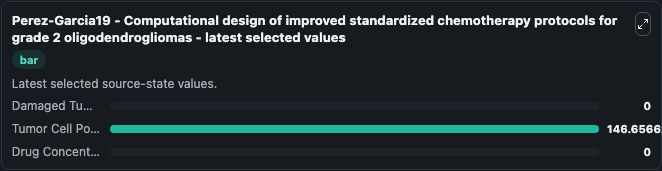

# Perez-Garcia19 - Computational design of improved standardized chemotherapy protocols for grade 2 oligodendrogliomas

This Biosimulant lab wraps `Perez-Garcia19 - Computational design of improved standardized chemotherapy protocols for grade 2 oligodendrogliomas` as a runnable oncology model with a companion visualization module.
This is a model built by COPASI4.24(Build 197)This a model from the article: Computational design of improved standardized chemotherapy protocols for grade II oligodendrogliomasVíctor M. It can be used to explore treatment-response dynamics and compare scenario outcomes across configurations.

## What You'll See

The lab asks: How does the bundled treatment-response model evolve under its baseline source conditions? It runs for 10.0 time units with a communication step of 1.0. The run uses the model defaults declared by the curated SBML wrapper. The generated visualizations focus on Damaged Tumor Cells D, Tumor Cell Population P, and Drug Concentration C, combining trajectory, endpoint-comparison, and summary-table views from one completed dark-mode run.

In this captured run, **Tumor_Cell_Population_P** carried the largest peak and **Tumor_Cell_Population_P** moved by **1.705** native units across 10.0 simulation windows.

<!-- BIOSIMULANT_VISUALS_START -->
### Output Visualizations



*Summary table for Perez-Garcia19 - Computational design of improved standardized chemotherapy protocols for grade 2 oligodendrogliomas, reporting the scientific question, observed answer (largest change: **Tumor_Cell_Population_P** at **1.705** native units), evidence (peak observable: **Tumor_Cell_Population_P**), dominant module, and caveat.*



*Trajectories of Damaged Tumor Cells D, Tumor Cell Population P, and Drug Concentration C across the 10.0 simulation. In this run **Tumor Cell Population P** climbed from 145.0 to 146.7 — the largest movements among the focused observables.*



*Endpoint ranking of the focused observables. Top 3 by final value: **Tumor Cell Population P** = 146.7, **Damaged Tumor Cells D** = 0, **Drug Concentration C** = 0.*

<!-- BIOSIMULANT_VISUALS_END -->

## Model Context

- Core model: `models/core`
- Visualization model: `models/visualisation`
- Standard: `other`
- Upstream source: `biomodels_ebi:BIOMD0000000814`
- License: `CC0`
- Visual scope: Drug/treatment response and tumour-state change
- Caveat: Values are native SBML quantities; the cleanup does not reinterpret source equations.

## Inputs

| Input | Maps To | Default | Notes |
|---|---|---|---|
| Dose 5 source parameter | `oncology_sbml_perez_garcia19_computational_design_of_improved_biomd0000000814_model.dose_5` | `0.0` | Dose 5 source parameter. Maps to bundled SBML parameter `dose_5`. |
| Dose 4 source parameter | `oncology_sbml_perez_garcia19_computational_design_of_improved_biomd0000000814_model.dose_4` | `0.0` | Dose 4 source parameter. Maps to bundled SBML parameter `dose_4`. |
| Dose3 source parameter | `oncology_sbml_perez_garcia19_computational_design_of_improved_biomd0000000814_model.dose3` | `0.0` | Dose3 source parameter. Maps to bundled SBML parameter `dose3`. |
| Dose2 source parameter | `oncology_sbml_perez_garcia19_computational_design_of_improved_biomd0000000814_model.dose2` | `0.0` | Dose2 source parameter. Maps to bundled SBML parameter `dose2`. |
| Damaged Tumor Cells D | `oncology_sbml_perez_garcia19_computational_design_of_improved_biomd0000000814_model.initial_damaged_tumor_cells_d` | `0.0` | Initial Damaged Tumor Cells D. Sets the initial value of bundled SBML symbol `Damaged_Tumor_Cells_D`. |
| Tumor Cell Population P | `oncology_sbml_perez_garcia19_computational_design_of_improved_biomd0000000814_model.initial_tumor_cell_population_p` | `144.952075141053` | Initial Tumor Cell Population P. Sets the initial value of bundled SBML symbol `Tumor_Cell_Population_P`. |

## Outputs

| Output | Maps To | Role |
|---|---|---|
| `damaged_tumor_cells_d` | `oncology_sbml_perez_garcia19_computational_design_of_improved_biomd0000000814_model.damaged_tumor_cells_d` | Damaged Tumor Cells D observable. |
| `tumor_cell_population_p` | `oncology_sbml_perez_garcia19_computational_design_of_improved_biomd0000000814_model.tumor_cell_population_p` | Tumor Cell Population P observable. |
| `drug_concentration_c` | `oncology_sbml_perez_garcia19_computational_design_of_improved_biomd0000000814_model.drug_concentration_c` | Drug Concentration C observable. |
| `state` | `oncology_sbml_perez_garcia19_computational_design_of_improved_biomd0000000814_model.state` | Full raw SBML observable record for reproducibility and downstream visualisation. |
| `summary` | `oncology_sbml_perez_garcia19_computational_design_of_improved_biomd0000000814_model.summary` | Change and peak summary across the simulated SBML observables. |
| `species_labels` | `oncology_sbml_perez_garcia19_computational_design_of_improved_biomd0000000814_model.species_labels` | Mapping from selected raw SBML observable symbols to display labels. |

## Runtime

- Duration: `10.0`
- Communication step: `1.0`

## Running Locally

```bash
biosimulant labs serve .
```
