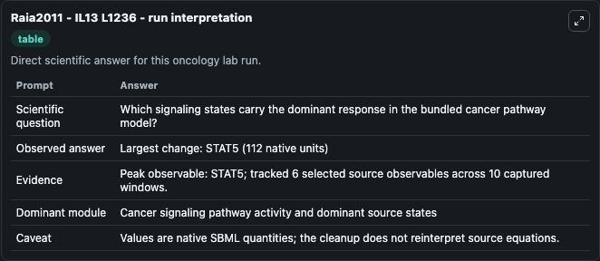
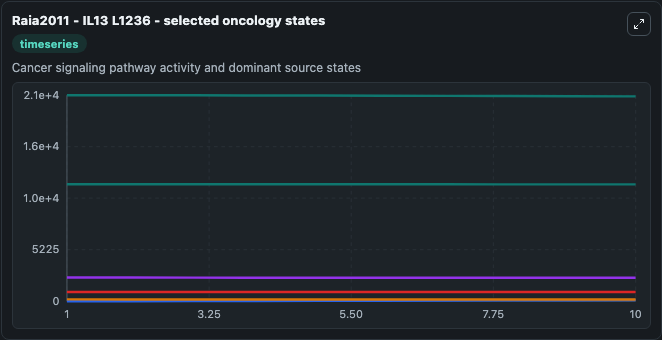
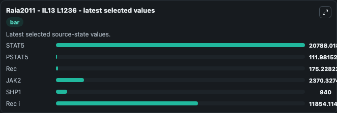

# Raia2011 - IL13 L1236

This Biosimulant lab wraps `Raia2011 - IL13 L1236` as a runnable oncology model with a companion visualization module.
This is the model of IL13 induced signalling in L1236 cells described in the article: Dynamic Mathematical Modeling of IL13-Induced Signaling in Hodgkin and Primary Mediastinal B-Cell Lymphoma Allows. It can be used to explore treatment-response dynamics and compare scenario outcomes across configurations.

## What You'll See

The lab asks: Which signaling states carry the dominant response in the bundled cancer pathway model? It runs for 10.0 time units with a communication step of 1.0. The run uses the model defaults declared by the curated SBML wrapper. The generated visualizations focus on STAT5, PSTAT5, Rec, JAK2, SHP1, and Rec i, combining trajectory, endpoint-comparison, and summary-table views from one completed dark-mode run.

In this captured run, **STAT5** peaked at **2.09e+04** and **STAT5** moved by **112.0** native units across 10.0 simulation windows.

<!-- BIOSIMULANT_VISUALS_START -->
### Output Visualizations



*Summary table for Raia2011 - IL13 L1236, reporting the scientific question, observed answer (largest change: **STAT5** at **112.0** native units), evidence (peak observable: **STAT5**), dominant module, and caveat.*



*Trajectories of STAT5, PSTAT5, Rec, JAK2, SHP1, and Rec i across the 10.0 simulation. In this run **PSTAT5** climbed from 0 to 112.0 and **STAT5** fell from 2.09e+04 to 2.08e+04 — the largest movements among the focused observables.*



*Endpoint ranking of the focused observables. Top 3 by final value: **STAT5** = 2.08e+04, **Rec i** = 1.19e+04, **JAK2** = 2370.3, with 3 more observables below.*

<!-- BIOSIMULANT_VISUALS_END -->

## Model Context

- Core model: `models/core`
- Visualization model: `models/visualisation`
- Standard: `other`
- Upstream source: `biomodels_ebi:BIOMD0000000314`
- License: `CC0`
- Visual scope: Cancer signaling pathway activity and dominant source states
- Caveat: Values are native SBML quantities; the cleanup does not reinterpret source equations.

## Inputs

| Input | Maps To | Default | Notes |
|---|---|---|---|
| Kon IL13Rec source parameter | `oncology_sbml_raia2011_il13_l1236_biomd0000000314_model.kon_il13rec_level` | `0.00174087` | Kon IL13Rec source parameter. Maps to bundled SBML parameter `Kon_IL13Rec`. |
| IL13stimulation source parameter | `oncology_sbml_raia2011_il13_l1236_biomd0000000314_model.il13stimulation_level` | `1.0` | IL13stimulation source parameter. Maps to bundled SBML parameter `IL13stimulation`. |
| STAT5 | `oncology_sbml_raia2011_il13_l1236_biomd0000000314_model.initial_stat5` | `209.0` | Initial STAT5. Sets the initial value of bundled SBML symbol `STAT5`. |
| PSTAT5 | `oncology_sbml_raia2011_il13_l1236_biomd0000000314_model.initial_pstat5` | `0.0` | Initial PSTAT5. Sets the initial value of bundled SBML symbol `pSTAT5`. |
| Rec | `oncology_sbml_raia2011_il13_l1236_biomd0000000314_model.initial_rec` | `1.8` | Initial Rec. Sets the initial value of bundled SBML symbol `Rec`. |
| JAK2 | `oncology_sbml_raia2011_il13_l1236_biomd0000000314_model.initial_jak2` | `24.0` | Initial JAK2. Sets the initial value of bundled SBML symbol `JAK2`. |

## Outputs

| Output | Maps To | Role |
|---|---|---|
| `stat5` | `oncology_sbml_raia2011_il13_l1236_biomd0000000314_model.stat5` | STAT5 observable. |
| `pstat5` | `oncology_sbml_raia2011_il13_l1236_biomd0000000314_model.pstat5` | PSTAT5 observable. |
| `rec` | `oncology_sbml_raia2011_il13_l1236_biomd0000000314_model.rec` | Rec observable. |
| `jak2` | `oncology_sbml_raia2011_il13_l1236_biomd0000000314_model.jak2` | JAK2 observable. |
| `shp1` | `oncology_sbml_raia2011_il13_l1236_biomd0000000314_model.shp1` | SHP1 observable. |
| `rec_i` | `oncology_sbml_raia2011_il13_l1236_biomd0000000314_model.rec_i` | Rec i observable. |
| `state` | `oncology_sbml_raia2011_il13_l1236_biomd0000000314_model.state` | Full raw SBML observable record for reproducibility and downstream visualisation. |
| `summary` | `oncology_sbml_raia2011_il13_l1236_biomd0000000314_model.summary` | Change and peak summary across the simulated SBML observables. |
| `species_labels` | `oncology_sbml_raia2011_il13_l1236_biomd0000000314_model.species_labels` | Mapping from selected raw SBML observable symbols to display labels. |

## Runtime

- Duration: `10.0`
- Communication step: `1.0`

## Running Locally

```bash
biosimulant labs serve .
```
