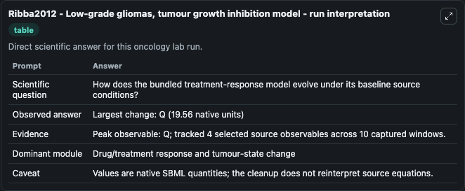
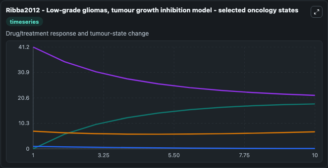
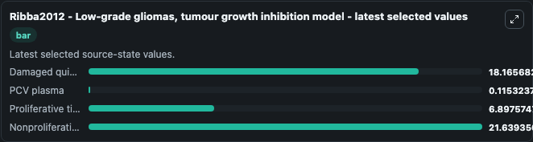

# Ribba2012 - Low-grade gliomas, tumour growth inhibition model

This Biosimulant lab wraps `Ribba2012 - Low-grade gliomas, tumour growth inhibition model` as a runnable oncology model with a companion visualization module.
Ribba2012 - Low-grade gliomas, tumour growth inhibition model Using longitudinal mean tumour diameter (MTD) data, this model describe the size evolution of low-grade glioma (LGG) in patients treated w. It can be used to explore treatment-response dynamics and compare scenario outcomes across configurations.

## What You'll See

The lab asks: How does the bundled treatment-response model evolve under its baseline source conditions? It runs for 10.0 time units with a communication step of 1.0. The run uses the model defaults declared by the curated SBML wrapper. The generated visualizations focus on Damaged quiescent cells, PCV plasma, Proliferative tissue, and Nonproliferative quiescent tissue, combining trajectory, endpoint-comparison, and summary-table views from one completed dark-mode run.

In this captured run, **Q** carried the largest peak and **Q** moved by **19.560** native units across 10.0 simulation windows.

<!-- BIOSIMULANT_VISUALS_START -->
### Output Visualizations



*Summary table for Ribba2012 - Low-grade gliomas, tumour growth inhibition model, reporting the scientific question, observed answer (largest change: **Q** at **19.560** native units), evidence (peak observable: **Q**), dominant module, and caveat.*



*Trajectories of Damaged quiescent cells, PCV plasma, Proliferative tissue, and Nonproliferative quiescent tissue across the 10.0 simulation. In this run **Damaged quiescent cells** climbed from 0 to 18.166 and **Nonproliferative quiescent tissue** fell from 41.200 to 21.639 — the largest movements among the focused observables.*



*Endpoint ranking of the focused observables. Top 3 by final value: **Nonproliferative quiescent tissue** = 21.639, **Damaged quiescent cells** = 18.166, **Proliferative tissue** = 6.898, with 1 more observable below.*

<!-- BIOSIMULANT_VISUALS_END -->

## Model Context

- Core model: `models/core`
- Visualization model: `models/visualisation`
- Standard: `other`
- Upstream source: `biomodels_ebi:BIOMD0000000521`
- License: `CC0`
- Visual scope: Drug/treatment response and tumour-state change
- Caveat: Values are native SBML quantities; the cleanup does not reinterpret source equations.

## Inputs

| Input | Maps To | Default | Notes |
|---|---|---|---|
| Damaged quiescent cells | `oncology_sbml_ribba2012_low_grade_gliomas_tumour_growth_inhibi_biomd0000000521_model.initial_damaged_quiescent_cells` | `0.0` | Initial Damaged quiescent cells. Sets the initial value of bundled SBML symbol `Qp`. |
| PCV plasma | `oncology_sbml_ribba2012_low_grade_gliomas_tumour_growth_inhibi_biomd0000000521_model.initial_pcv_plasma` | `1.0` | Initial PCV plasma. Sets the initial value of bundled SBML symbol `C`. |
| Proliferative tissue | `oncology_sbml_ribba2012_low_grade_gliomas_tumour_growth_inhibi_biomd0000000521_model.initial_proliferative_tissue` | `7.13` | Initial Proliferative tissue. Sets the initial value of bundled SBML symbol `P`. |
| Nonproliferative quiescent tissue | `oncology_sbml_ribba2012_low_grade_gliomas_tumour_growth_inhibi_biomd0000000521_model.initial_nonproliferative_quiescent_tissue` | `41.2` | Initial Nonproliferative quiescent tissue. Sets the initial value of bundled SBML symbol `Q`. |

## Outputs

| Output | Maps To | Role |
|---|---|---|
| `damaged_quiescent_cells` | `oncology_sbml_ribba2012_low_grade_gliomas_tumour_growth_inhibi_biomd0000000521_model.damaged_quiescent_cells` | Damaged quiescent cells observable. |
| `pcv_plasma` | `oncology_sbml_ribba2012_low_grade_gliomas_tumour_growth_inhibi_biomd0000000521_model.pcv_plasma` | PCV plasma observable. |
| `proliferative_tissue` | `oncology_sbml_ribba2012_low_grade_gliomas_tumour_growth_inhibi_biomd0000000521_model.proliferative_tissue` | Proliferative tissue observable. |
| `nonproliferative_quiescent_tissue` | `oncology_sbml_ribba2012_low_grade_gliomas_tumour_growth_inhibi_biomd0000000521_model.nonproliferative_quiescent_tissue` | Nonproliferative quiescent tissue observable. |
| `state` | `oncology_sbml_ribba2012_low_grade_gliomas_tumour_growth_inhibi_biomd0000000521_model.state` | Full raw SBML observable record for reproducibility and downstream visualisation. |
| `summary` | `oncology_sbml_ribba2012_low_grade_gliomas_tumour_growth_inhibi_biomd0000000521_model.summary` | Change and peak summary across the simulated SBML observables. |
| `species_labels` | `oncology_sbml_ribba2012_low_grade_gliomas_tumour_growth_inhibi_biomd0000000521_model.species_labels` | Mapping from selected raw SBML observable symbols to display labels. |

## Runtime

- Duration: `10.0`
- Communication step: `1.0`

## Running Locally

```bash
biosimulant labs serve .
```
