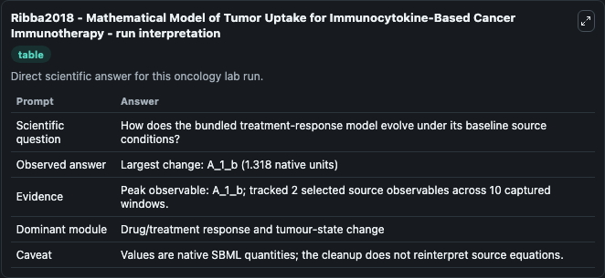
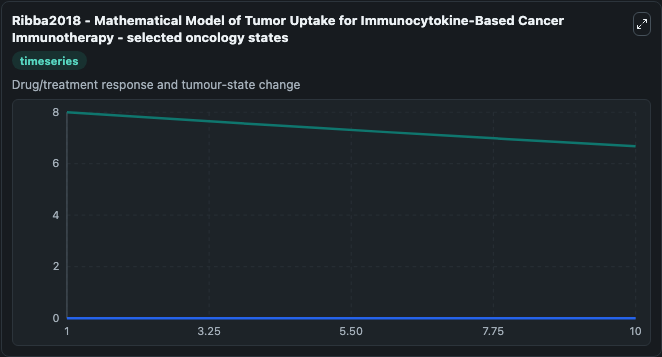
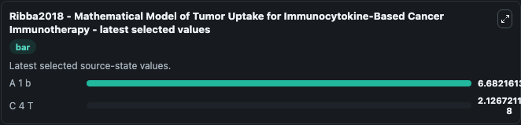

# Ribba2018 - Mathematical Model of Tumor Uptake for Immunocytokine-Based Cancer Immunotherapy

This Biosimulant lab wraps `Ribba2018 - Mathematical Model of Tumor Uptake for Immunocytokine-Based Cancer Immunotherapy` as a runnable oncology model with a companion visualization module.
This is a model developed to predict concentrations of cergutuzumab amunaleukin (CEA-IL2v) after various systemic dosing intensities. It can be used to explore treatment-response dynamics and compare scenario outcomes across configurations.

## What You'll See

The lab asks: How does the bundled treatment-response model evolve under its baseline source conditions? It runs for 10.0 time units with a communication step of 1.0. The run uses the model defaults declared by the curated SBML wrapper. The generated visualizations focus on A 1 b, and C 4 T, combining trajectory, endpoint-comparison, and summary-table views from one completed dark-mode run.

In this captured run, **A_1_b** carried the largest peak and **A_1_b** moved by **1.318** native units across 10.0 simulation windows.

<!-- BIOSIMULANT_VISUALS_START -->
### Output Visualizations



*Summary table for Ribba2018 - Mathematical Model of Tumor Uptake for Immunocytokine-Based Cancer Immunotherapy, reporting the scientific question, observed answer (largest change: **A_1_b** at **1.318** native units), evidence (peak observable: **A_1_b**), dominant module, and caveat.*



*Trajectories of A 1 b, and C 4 T across the 10.0 simulation. In this run **C 4 T** climbed from 0 to 2.13e-08 and **A 1 b** fell from 8.000 to 6.682 — the largest movements among the focused observables.*



*Endpoint ranking of the focused observables. Top 2 by final value: **A 1 b** = 6.682, **C 4 T** = 2.13e-08.*

<!-- BIOSIMULANT_VISUALS_END -->

## Model Context

- Core model: `models/core`
- Visualization model: `models/visualisation`
- Standard: `other`
- Upstream source: `biomodels_ebi:MODEL1909050002`
- License: `CC0`
- Visual scope: Drug/treatment response and tumour-state change
- Caveat: Values are native SBML quantities; the cleanup does not reinterpret source equations.

## Inputs

| Input | Maps To | Default | Notes |
|---|---|---|---|
| Epsilon source parameter | `oncology_sbml_ribba2018_mathematical_model_of_tumor_uptake_for_model1909050002_model.epsilon_level` | `0.25` | Epsilon source parameter. Maps to bundled SBML parameter `epsilon`. |
| for epsilon source parameter | `oncology_sbml_ribba2018_mathematical_model_of_tumor_uptake_for_model1909050002_model.initial_for_epsilon` | `0.25` | Initial for epsilon source parameter. Maps to bundled SBML parameter `ModelValue_2`. |
| A 1 b | `oncology_sbml_ribba2018_mathematical_model_of_tumor_uptake_for_model1909050002_model.initial_a_1_b` | `8.0` | Initial A 1 b. Sets the initial value of bundled SBML symbol `A_1_b`. |
| C 4 T | `oncology_sbml_ribba2018_mathematical_model_of_tumor_uptake_for_model1909050002_model.initial_c_4_t` | `0.0` | Initial C 4 T. Sets the initial value of bundled SBML symbol `C_4_T`. |

## Outputs

| Output | Maps To | Role |
|---|---|---|
| `a_1_b` | `oncology_sbml_ribba2018_mathematical_model_of_tumor_uptake_for_model1909050002_model.a_1_b` | A 1 b observable. |
| `c_4_t` | `oncology_sbml_ribba2018_mathematical_model_of_tumor_uptake_for_model1909050002_model.c_4_t` | C 4 T observable. |
| `state` | `oncology_sbml_ribba2018_mathematical_model_of_tumor_uptake_for_model1909050002_model.state` | Full raw SBML observable record for reproducibility and downstream visualisation. |
| `summary` | `oncology_sbml_ribba2018_mathematical_model_of_tumor_uptake_for_model1909050002_model.summary` | Change and peak summary across the simulated SBML observables. |
| `species_labels` | `oncology_sbml_ribba2018_mathematical_model_of_tumor_uptake_for_model1909050002_model.species_labels` | Mapping from selected raw SBML observable symbols to display labels. |

## Runtime

- Duration: `10.0`
- Communication step: `1.0`

## Running Locally

```bash
biosimulant labs serve .
```
