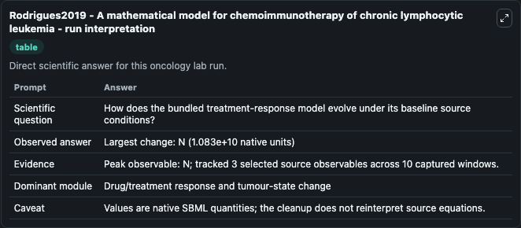
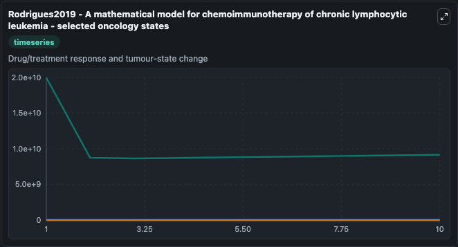
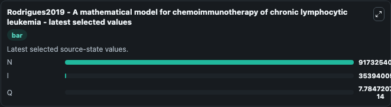

# Rodrigues2019 - A mathematical model for chemoimmunotherapy of chronic lymphocytic leukemia

This Biosimulant lab wraps `Rodrigues2019 - A mathematical model for chemoimmunotherapy of chronic lymphocytic leukemia` as a runnable oncology model with a companion visualization module.
THis is a simple ordinary differential equation model describing chemoimmunotherapy of chronic lymphocytic leukemia, including descriptions of the combinatorial effects of chemotherapy and adoptive ce. It can be used to explore treatment-response dynamics and compare scenario outcomes across configurations.

## What You'll See

The lab asks: How does the bundled treatment-response model evolve under its baseline source conditions? It runs for 10.0 time units with a communication step of 1.0. The run uses the model defaults declared by the curated SBML wrapper. The generated visualizations focus on N, I, and Q, combining trajectory, endpoint-comparison, and summary-table views from one completed dark-mode run.

In this captured run, **N** peaked at **2e+10** and **N** moved by **1.08e+10** native units across 10.0 simulation windows.

<!-- BIOSIMULANT_VISUALS_START -->
### Output Visualizations



*Summary table for Rodrigues2019 - A mathematical model for chemoimmunotherapy of chronic lymphocytic leukemia, reporting the scientific question, observed answer (largest change: **N** at **1.08e+10** native units), evidence (peak observable: **N**), dominant module, and caveat.*



*Trajectories of N, I, and Q across the 10.0 simulation. In this run **Q** climbed from 0 to 7.78e-14 and **N** fell from 2e+10 to 9.17e+09 — the largest movements among the focused observables.*



*Endpoint ranking of the focused observables. Top 3 by final value: **N** = 9.17e+09, **I** = 3.54e+07, **Q** = 7.78e-14.*

<!-- BIOSIMULANT_VISUALS_END -->

## Model Context

- Core model: `models/core`
- Visualization model: `models/visualisation`
- Standard: `other`
- Upstream source: `biomodels_ebi:BIOMD0000000879`
- License: `CC0`
- Visual scope: Drug/treatment response and tumour-state change
- Caveat: Values are native SBML quantities; the cleanup does not reinterpret source equations.

## Inputs

| Input | Maps To | Default | Notes |
|---|---|---|---|
| Chemotherapy Input source parameter | `oncology_sbml_rodrigues2019_a_mathematical_model_for_chemoimmu_biomd0000000879_model.chemotherapy_input_level` | `8640.0` | Chemotherapy Input source parameter. Maps to bundled SBML parameter `Chemotherapy_Input`. |
| Immunotherapy Input source parameter | `oncology_sbml_rodrigues2019_a_mathematical_model_for_chemoimmu_biomd0000000879_model.immunotherapy_input_level` | `0.0` | Immunotherapy Input source parameter. Maps to bundled SBML parameter `Immunotherapy_Input`. |
| Infusion Dose source parameter | `oncology_sbml_rodrigues2019_a_mathematical_model_for_chemoimmu_biomd0000000879_model.infusion_dose` | `1080.0` | Infusion Dose source parameter. Maps to bundled SBML parameter `Infusion_Dose`. |

## Outputs

| Output | Maps To | Role |
|---|---|---|
| `model_state_1` | `oncology_sbml_rodrigues2019_a_mathematical_model_for_chemoimmu_biomd0000000879_model.model_state_1` | N observable. |
| `model_state_2` | `oncology_sbml_rodrigues2019_a_mathematical_model_for_chemoimmu_biomd0000000879_model.model_state_2` | I observable. |
| `model_state_3` | `oncology_sbml_rodrigues2019_a_mathematical_model_for_chemoimmu_biomd0000000879_model.model_state_3` | Q observable. |
| `state` | `oncology_sbml_rodrigues2019_a_mathematical_model_for_chemoimmu_biomd0000000879_model.state` | Full raw SBML observable record for reproducibility and downstream visualisation. |
| `summary` | `oncology_sbml_rodrigues2019_a_mathematical_model_for_chemoimmu_biomd0000000879_model.summary` | Change and peak summary across the simulated SBML observables. |
| `species_labels` | `oncology_sbml_rodrigues2019_a_mathematical_model_for_chemoimmu_biomd0000000879_model.species_labels` | Mapping from selected raw SBML observable symbols to display labels. |

## Runtime

- Duration: `10.0`
- Communication step: `1.0`

## Running Locally

```bash
biosimulant labs serve .
```
