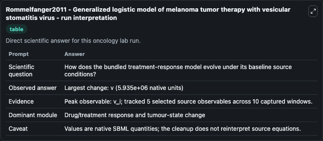
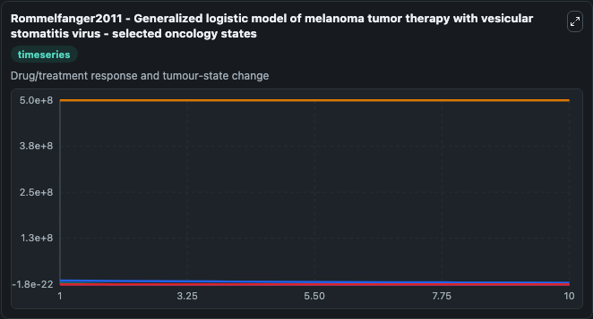
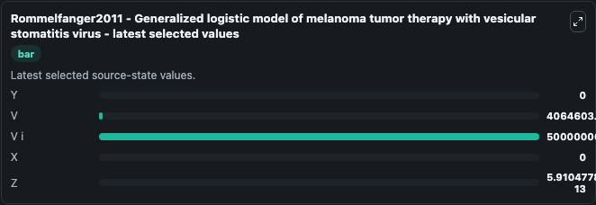

# Rommelfanger2011 - Generalized logistic model of melanoma tumor therapy with vesicular stomatitis virus

This Biosimulant lab wraps `Rommelfanger2011 - Generalized logistic model of melanoma tumor therapy with vesicular stomatitis virus` as a runnable oncology model with a companion visualization module.
This mathematical model is described by the publication:Rommelfanger DM, Offord CP, Dev J, Bajzer Z, Vile RG, Dingli D. 'Dynamics of melanoma tumor therapy with vesicular stomatitis virus: explaining. It can be used to explore treatment-response dynamics and compare scenario outcomes across configurations.

## What You'll See

The lab asks: How does the bundled treatment-response model evolve under its baseline source conditions? It runs for 10.0 time units with a communication step of 1.0. The run uses the model defaults declared by the curated SBML wrapper. The generated visualizations focus on Y, V, V i, X, and Z, combining trajectory, endpoint-comparison, and summary-table views from one completed dark-mode run.

In this captured run, **v_i** carried the largest peak and **v** moved by **5.94e+06** native units across 10.0 simulation windows.

<!-- BIOSIMULANT_VISUALS_START -->
### Output Visualizations



*Summary table for Rommelfanger2011 - Generalized logistic model of melanoma tumor therapy with vesicular stomatitis virus, reporting the scientific question, observed answer (largest change: **v** at **5.94e+06** native units), evidence (peak observable: **v_i**), dominant module, and caveat.*



*Trajectories of Y, V, V i, X, and Z across the 10.0 simulation. In this run **Z** climbed from 0 to 5.91e-13 and **V** fell from 1e+07 to 4.06e+06 — the largest movements among the focused observables.*



*Endpoint ranking of the focused observables. Top 3 by final value: **V i** = 5e+08, **V** = 4.06e+06, **Z** = 5.91e-13, with 2 more observables below.*

<!-- BIOSIMULANT_VISUALS_END -->

## Model Context

- Core model: `models/core`
- Visualization model: `models/visualisation`
- Standard: `other`
- Upstream source: `biomodels_ebi:MODEL2109110004`
- License: `CC0`
- Visual scope: Drug/treatment response and tumour-state change
- Caveat: Values are native SBML quantities; the cleanup does not reinterpret source equations.

## Inputs

| Input | Maps To | Default | Notes |
|---|---|---|---|
| Epsilon source parameter | `oncology_sbml_rommelfanger2011_generalized_logistic_model_of_m_model2109110004_model.epsilon_level` | `3.0` | Epsilon source parameter. Maps to bundled SBML parameter `epsilon`. |

## Outputs

| Output | Maps To | Role |
|---|---|---|
| `model_state_1` | `oncology_sbml_rommelfanger2011_generalized_logistic_model_of_m_model2109110004_model.model_state_1` | Y observable. |
| `model_state_2` | `oncology_sbml_rommelfanger2011_generalized_logistic_model_of_m_model2109110004_model.model_state_2` | V observable. |
| `model_state_3` | `oncology_sbml_rommelfanger2011_generalized_logistic_model_of_m_model2109110004_model.model_state_3` | V i observable. |
| `model_state_4` | `oncology_sbml_rommelfanger2011_generalized_logistic_model_of_m_model2109110004_model.model_state_4` | X observable. |
| `model_state_5` | `oncology_sbml_rommelfanger2011_generalized_logistic_model_of_m_model2109110004_model.model_state_5` | Z observable. |
| `state` | `oncology_sbml_rommelfanger2011_generalized_logistic_model_of_m_model2109110004_model.state` | Full raw SBML observable record for reproducibility and downstream visualisation. |
| `summary` | `oncology_sbml_rommelfanger2011_generalized_logistic_model_of_m_model2109110004_model.summary` | Change and peak summary across the simulated SBML observables. |
| `species_labels` | `oncology_sbml_rommelfanger2011_generalized_logistic_model_of_m_model2109110004_model.species_labels` | Mapping from selected raw SBML observable symbols to display labels. |

## Runtime

- Duration: `10.0`
- Communication step: `1.0`

## Running Locally

```bash
biosimulant labs serve .
```
