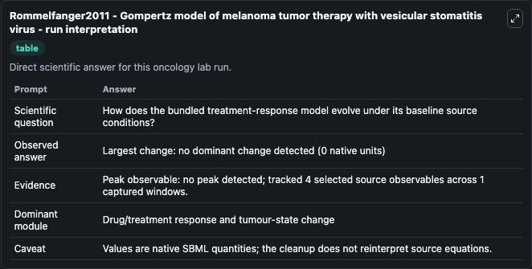
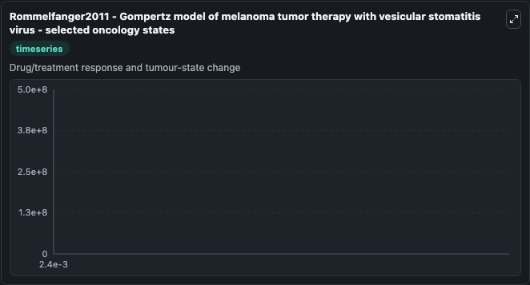
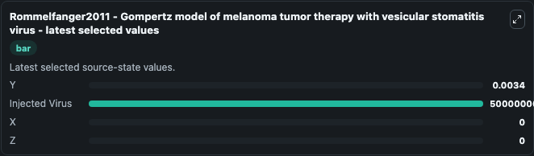

# Rommelfanger2011 - Gompertz model of melanoma tumor therapy with vesicular stomatitis virus

This Biosimulant lab wraps `Rommelfanger2011 - Gompertz model of melanoma tumor therapy with vesicular stomatitis virus` as a runnable oncology model with a companion visualization module.
This mathematical model is described by the publication:Rommelfanger DM, Offord CP, Dev J, Bajzer Z, Vile RG, Dingli D. 'Dynamics of melanoma tumor therapy with vesicular stomatitis virus: explaining. It can be used to explore treatment-response dynamics and compare scenario outcomes across configurations.

## What You'll See

The lab asks: How does the bundled treatment-response model evolve under its baseline source conditions? It runs for 0.0024 time units with a communication step of 1.0. The run uses the model defaults declared by the curated SBML wrapper. The generated visualizations focus on Y, Injected Virus, X, and Z, combining trajectory, endpoint-comparison, and summary-table views from one completed dark-mode run.

In this captured run, **no** carried the largest peak and **no dominant change detected** moved by **0** native units across 0.0024 simulation windows.

<!-- BIOSIMULANT_VISUALS_START -->
### Output Visualizations



*Summary table for Rommelfanger2011 - Gompertz model of melanoma tumor therapy with vesicular stomatitis virus, reporting the scientific question, observed answer (largest change: **no dominant change detected** at **0** native units), evidence (peak observable: **no**), dominant module, and caveat.*



*Trajectories of Y, Injected Virus, X, and Z across the 0.0024 simulation. In this run Y, Injected Virus, X, Z stayed near their initial values — no observable moved appreciably.*



*Largest-excursion ranking of the focused observables — the absolute movement magnitude during the run. Top 3: **Injected Virus** = 5e+08, **Y** = 0.0034, **X** = 0, with 1 more observable below.*

<!-- BIOSIMULANT_VISUALS_END -->

## Model Context

- Core model: `models/core`
- Visualization model: `models/visualisation`
- Standard: `other`
- Upstream source: `biomodels_ebi:MODEL2109110003`
- License: `CC0`
- Visual scope: Drug/treatment response and tumour-state change
- Caveat: Values are native SBML quantities; the cleanup does not reinterpret source equations.

## Inputs

| Input | Maps To | Default | Notes |
|---|---|---|---|
| Injected Virus | `oncology_sbml_rommelfanger2011_gompertz_model_of_melanoma_tumo_model2109110003_model.initial_injected_virus` | `500000000.0` | Initial Injected Virus. Sets the initial value of bundled SBML symbol `v_i`. |

## Outputs

| Output | Maps To | Role |
|---|---|---|
| `injected_virus` | `oncology_sbml_rommelfanger2011_gompertz_model_of_melanoma_tumo_model2109110003_model.injected_virus` | Injected Virus observable. |
| `state` | `oncology_sbml_rommelfanger2011_gompertz_model_of_melanoma_tumo_model2109110003_model.state` | Full raw SBML observable record for reproducibility and downstream visualisation. |
| `summary` | `oncology_sbml_rommelfanger2011_gompertz_model_of_melanoma_tumo_model2109110003_model.summary` | Change and peak summary across the simulated SBML observables. |
| `species_labels` | `oncology_sbml_rommelfanger2011_gompertz_model_of_melanoma_tumo_model2109110003_model.species_labels` | Mapping from selected raw SBML observable symbols to display labels. |

## Runtime

- Duration: `0.0024`
- Communication step: `1.0`

## Running Locally

```bash
biosimulant labs serve .
```
