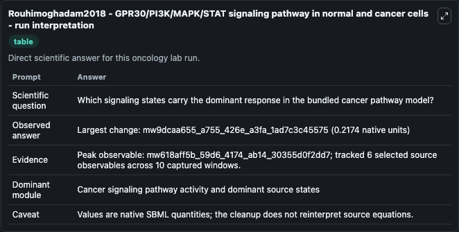
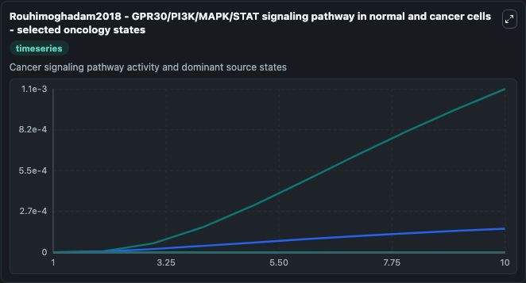
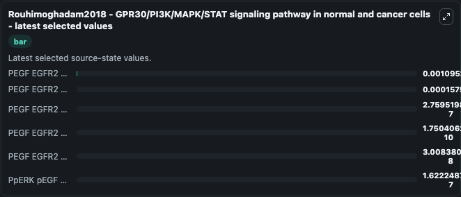

# Rouhimoghadam2018 - GPR30/PI3K/MAPK/STAT signaling pathway in normal and cancer cells

This Biosimulant lab wraps `Rouhimoghadam2018 - GPR30/PI3K/MAPK/STAT signaling pathway in normal and cancer cells` as a runnable oncology model with a companion visualization module.
In the current study, we aimed to simulate the GPR30/PI3K/MAPK/STAT signaling pathway in normal and cancer cells by the use of ordinary differential equation modeling. It can be used to explore treatment-response dynamics and compare scenario outcomes across configurations.

## What You'll See

The lab asks: Which signaling states carry the dominant response in the bundled cancer pathway model? It runs for 10.0 time units with a communication step of 1.0. The run uses the model defaults declared by the curated SBML wrapper. The generated visualizations focus on PEGF EGFR2 pShc Grb2 SOS Ras GDP, PEGF EGFR2 Grb2 SOS Ras GDP, PEGF EGFR2 Ras GAP, PEGF EGFR2 Ras GAP Ras GTP, PEGF EGFR2 Ras GAP SHP2, and PpERK pEGF EGFR2 pShc Grb2 SOS, combining trajectory, endpoint-comparison, and summary-table views from one completed dark-mode run.

In this captured run, **mw618aff5b_59d6_4174_ab14_30355d0f2dd7** carried the largest peak and **mw9dcaa655_a755_426e_a3fa_1ad7c3c45575** moved by **0.2174** native units across 10.0 simulation windows.

<!-- BIOSIMULANT_VISUALS_START -->
### Output Visualizations



*Summary table for Rouhimoghadam2018 - GPR30/PI3K/MAPK/STAT signaling pathway in normal and cancer cells, reporting the scientific question, observed answer (largest change: **mw9dcaa655_a755_426e_a3fa_1ad7c3c45575** at **0.2174** native units), evidence (peak observable: **mw618aff5b_59d6_4174_ab14_30355d0f2dd7**), dominant module, and caveat.*



*Trajectories of PEGF EGFR2 pShc Grb2 SOS Ras GDP, PEGF EGFR2 Grb2 SOS Ras GDP, PEGF EGFR2 Ras GAP, PEGF EGFR2 Ras GAP Ras GTP, PEGF EGFR2 Ras GAP SHP2, and PpERK pEGF EGFR2 pShc Grb2 SOS across the 10.0 simulation. In this run **PEGF EGFR2 pShc Grb2 SOS Ras GDP** climbed from 0 to 0.0011 — the largest movements among the focused observables.*



*Endpoint ranking of the focused observables. Top 3 by final value: **PEGF EGFR2 pShc Grb2 SOS Ras GDP** = 0.0011, **PEGF EGFR2 Grb2 SOS Ras GDP** = 0.000158, **PEGF EGFR2 Ras GAP** = 2.76e-07, with 3 more observables below.*

<!-- BIOSIMULANT_VISUALS_END -->

## Model Context

- Core model: `models/core`
- Visualization model: `models/visualisation`
- Standard: `other`
- Upstream source: `biomodels_ebi:MODEL2002250001`
- License: `CC0`
- Visual scope: Cancer signaling pathway activity and dominant source states
- Caveat: Values are native SBML quantities; the cleanup does not reinterpret source equations.

## Inputs

| Input | Maps To | Default | Notes |
|---|---|---|---|
| PEGF EGFR2 pShc Grb2 SOS Ras GDP | `oncology_sbml_rouhimoghadam2018_gpr30_pi3k_mapk_stat_signaling_model2002250001_model.initial_pegf_egfr2_pshc_grb2_sos_ras_gdp` | `0.0` | Initial PEGF EGFR2 pShc Grb2 SOS Ras GDP. Sets the initial value of bundled SBML symbol `mwf40d6176_abfc_4a30_886f_83a19fcffc48`. |
| PEGF EGFR2 Grb2 SOS Ras GDP | `oncology_sbml_rouhimoghadam2018_gpr30_pi3k_mapk_stat_signaling_model2002250001_model.initial_pegf_egfr2_grb2_sos_ras_gdp` | `0.0` | Initial PEGF EGFR2 Grb2 SOS Ras GDP. Sets the initial value of bundled SBML symbol `mw28464aad_8013_4a23_ae09_a406954859a6`. |
| PEGF EGFR2 Ras GAP | `oncology_sbml_rouhimoghadam2018_gpr30_pi3k_mapk_stat_signaling_model2002250001_model.initial_pegf_egfr2_ras_gap` | `0.0` | Initial PEGF EGFR2 Ras GAP. Sets the initial value of bundled SBML symbol `mwd39388fd_4f85_4d1c_b2a3_37857c595a2d`. |
| PEGF EGFR2 Ras GAP Ras GTP | `oncology_sbml_rouhimoghadam2018_gpr30_pi3k_mapk_stat_signaling_model2002250001_model.initial_pegf_egfr2_ras_gap_ras_gtp` | `0.0` | Initial PEGF EGFR2 Ras GAP Ras GTP. Sets the initial value of bundled SBML symbol `mwd7bf31ba_b05c_4c45_bb2f_6a2468a2a507`. |
| PEGF EGFR2 Ras GAP SHP2 | `oncology_sbml_rouhimoghadam2018_gpr30_pi3k_mapk_stat_signaling_model2002250001_model.initial_pegf_egfr2_ras_gap_shp2` | `0.0` | Initial PEGF EGFR2 Ras GAP SHP2. Sets the initial value of bundled SBML symbol `mwbf5cb039_b830_4282_aa22_a3dda6272ec1`. |
| PpERK pEGF EGFR2 pShc Grb2 SOS | `oncology_sbml_rouhimoghadam2018_gpr30_pi3k_mapk_stat_signaling_model2002250001_model.initial_pperk_pegf_egfr2_pshc_grb2_sos` | `0.0` | Initial PpERK pEGF EGFR2 pShc Grb2 SOS. Sets the initial value of bundled SBML symbol `mw5babe3d5_a9af_4dfd_ac01_35474ef64af2`. |

## Outputs

| Output | Maps To | Role |
|---|---|---|
| `pegf_egfr2_pshc_grb2_sos_ras_gdp` | `oncology_sbml_rouhimoghadam2018_gpr30_pi3k_mapk_stat_signaling_model2002250001_model.pegf_egfr2_pshc_grb2_sos_ras_gdp` | PEGF EGFR2 pShc Grb2 SOS Ras GDP observable. |
| `pegf_egfr2_grb2_sos_ras_gdp` | `oncology_sbml_rouhimoghadam2018_gpr30_pi3k_mapk_stat_signaling_model2002250001_model.pegf_egfr2_grb2_sos_ras_gdp` | PEGF EGFR2 Grb2 SOS Ras GDP observable. |
| `pegf_egfr2_ras_gap` | `oncology_sbml_rouhimoghadam2018_gpr30_pi3k_mapk_stat_signaling_model2002250001_model.pegf_egfr2_ras_gap` | PEGF EGFR2 Ras GAP observable. |
| `pegf_egfr2_ras_gap_ras_gtp` | `oncology_sbml_rouhimoghadam2018_gpr30_pi3k_mapk_stat_signaling_model2002250001_model.pegf_egfr2_ras_gap_ras_gtp` | PEGF EGFR2 Ras GAP Ras GTP observable. |
| `pegf_egfr2_ras_gap_shp2` | `oncology_sbml_rouhimoghadam2018_gpr30_pi3k_mapk_stat_signaling_model2002250001_model.pegf_egfr2_ras_gap_shp2` | PEGF EGFR2 Ras GAP SHP2 observable. |
| `pperk_pegf_egfr2_pshc_grb2_sos` | `oncology_sbml_rouhimoghadam2018_gpr30_pi3k_mapk_stat_signaling_model2002250001_model.pperk_pegf_egfr2_pshc_grb2_sos` | PpERK pEGF EGFR2 pShc Grb2 SOS observable. |
| `state` | `oncology_sbml_rouhimoghadam2018_gpr30_pi3k_mapk_stat_signaling_model2002250001_model.state` | Full raw SBML observable record for reproducibility and downstream visualisation. |
| `summary` | `oncology_sbml_rouhimoghadam2018_gpr30_pi3k_mapk_stat_signaling_model2002250001_model.summary` | Change and peak summary across the simulated SBML observables. |
| `species_labels` | `oncology_sbml_rouhimoghadam2018_gpr30_pi3k_mapk_stat_signaling_model2002250001_model.species_labels` | Mapping from selected raw SBML observable symbols to display labels. |

## Runtime

- Duration: `10.0`
- Communication step: `1.0`

## Running Locally

```bash
biosimulant labs serve .
```
