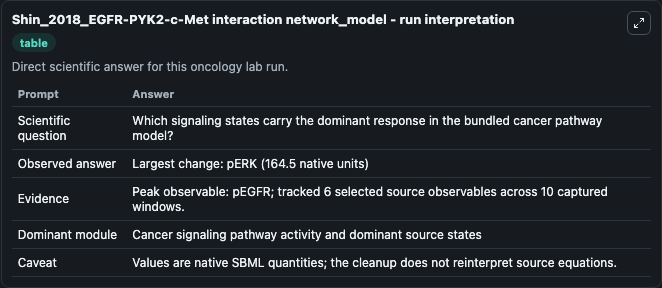
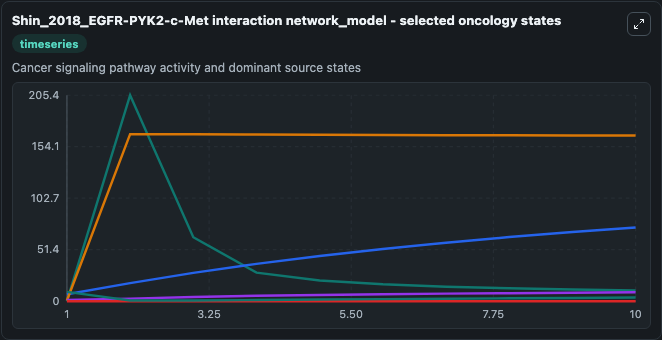
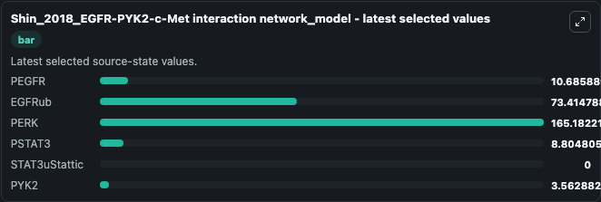

# Shin_2018_EGFR-PYK2-c-Met interaction network_model

This Biosimulant lab wraps `Shin_2018_EGFR-PYK2-c-Met interaction network_model` as a runnable oncology model with a companion visualization module.
Systems modelling of the EGFR-PYK2-c-Met interaction network predicted and prioritized synergistic drug combinations for Triple-negative breast cancer. It can be used to explore treatment-response dynamics and compare scenario outcomes across configurations.

## What You'll See

The lab asks: Which signaling states carry the dominant response in the bundled cancer pathway model? It runs for 10.0 time units with a communication step of 1.0. The run uses the model defaults declared by the curated SBML wrapper. The generated visualizations focus on PEGFR, EGFRub, PERK, PSTAT3, STAT3uStattic, and PYK2, combining trajectory, endpoint-comparison, and summary-table views from one completed dark-mode run.

In this captured run, **pEGFR** carried the largest peak and **pERK** moved by **164.5** native units across 10.0 simulation windows.

<!-- BIOSIMULANT_VISUALS_START -->
### Output Visualizations



*Summary table for Shin_2018_EGFR-PYK2-c-Met interaction network_model, reporting the scientific question, observed answer (largest change: **pERK** at **164.5** native units), evidence (peak observable: **pEGFR**), dominant module, and caveat.*



*Trajectories of PEGFR, EGFRub, PERK, PSTAT3, STAT3uStattic, and PYK2 across the 10.0 simulation. In this run **PERK** climbed from 0.6690 to 165.2 and **PYK2** fell from 9.299 to 3.563 — the largest movements among the focused observables.*



*Endpoint ranking of the focused observables. Top 3 by final value: **PERK** = 165.2, **EGFRub** = 73.415, **PEGFR** = 10.686, with 3 more observables below.*

<!-- BIOSIMULANT_VISUALS_END -->

## Model Context

- Core model: `models/core`
- Visualization model: `models/visualisation`
- Standard: `other`
- Upstream source: `biomodels_ebi:BIOMD0000000826`
- License: `CC0`
- Visual scope: Cancer signaling pathway activity and dominant source states
- Caveat: Values are native SBML quantities; the cleanup does not reinterpret source equations.

## Inputs

| Input | Maps To | Default | Notes |
|---|---|---|---|
| EGFRtot source parameter | `oncology_sbml_shin_2018_egfr_pyk2_c_met_interaction_network_mo_biomd0000000826_model.egfrtot_level` | `398.107` | EGFRtot source parameter. Maps to bundled SBML parameter `EGFRtot`. |
| CaEGF source parameter | `oncology_sbml_shin_2018_egfr_pyk2_c_met_interaction_network_mo_biomd0000000826_model.caegf_level` | `0.0891251` | CaEGF source parameter. Maps to bundled SBML parameter `caEGF`. |
| EGF source parameter | `oncology_sbml_shin_2018_egfr_pyk2_c_met_interaction_network_mo_biomd0000000826_model.egf_level` | `10.0` | EGF source parameter. Maps to bundled SBML parameter `EGF`. |
| PEGFR | `oncology_sbml_shin_2018_egfr_pyk2_c_met_interaction_network_mo_biomd0000000826_model.initial_pegfr` | `0.109014` | Initial PEGFR. Sets the initial value of bundled SBML symbol `pEGFR`. |
| EGFRub | `oncology_sbml_shin_2018_egfr_pyk2_c_met_interaction_network_mo_biomd0000000826_model.initial_egfrub` | `6.93991` | Initial EGFRub. Sets the initial value of bundled SBML symbol `EGFRub`. |
| PERK | `oncology_sbml_shin_2018_egfr_pyk2_c_met_interaction_network_mo_biomd0000000826_model.initial_perk` | `0.669043` | Initial PERK. Sets the initial value of bundled SBML symbol `pERK`. |

## Outputs

| Output | Maps To | Role |
|---|---|---|
| `pegfr` | `oncology_sbml_shin_2018_egfr_pyk2_c_met_interaction_network_mo_biomd0000000826_model.pegfr` | PEGFR observable. |
| `egfrub` | `oncology_sbml_shin_2018_egfr_pyk2_c_met_interaction_network_mo_biomd0000000826_model.egfrub` | EGFRub observable. |
| `perk` | `oncology_sbml_shin_2018_egfr_pyk2_c_met_interaction_network_mo_biomd0000000826_model.perk` | PERK observable. |
| `pstat3` | `oncology_sbml_shin_2018_egfr_pyk2_c_met_interaction_network_mo_biomd0000000826_model.pstat3` | PSTAT3 observable. |
| `stat3ustattic` | `oncology_sbml_shin_2018_egfr_pyk2_c_met_interaction_network_mo_biomd0000000826_model.stat3ustattic` | STAT3uStattic observable. |
| `pyk2` | `oncology_sbml_shin_2018_egfr_pyk2_c_met_interaction_network_mo_biomd0000000826_model.pyk2` | PYK2 observable. |
| `state` | `oncology_sbml_shin_2018_egfr_pyk2_c_met_interaction_network_mo_biomd0000000826_model.state` | Full raw SBML observable record for reproducibility and downstream visualisation. |
| `summary` | `oncology_sbml_shin_2018_egfr_pyk2_c_met_interaction_network_mo_biomd0000000826_model.summary` | Change and peak summary across the simulated SBML observables. |
| `species_labels` | `oncology_sbml_shin_2018_egfr_pyk2_c_met_interaction_network_mo_biomd0000000826_model.species_labels` | Mapping from selected raw SBML observable symbols to display labels. |

## Runtime

- Duration: `10.0`
- Communication step: `1.0`

## Running Locally

```bash
biosimulant labs serve .
```
