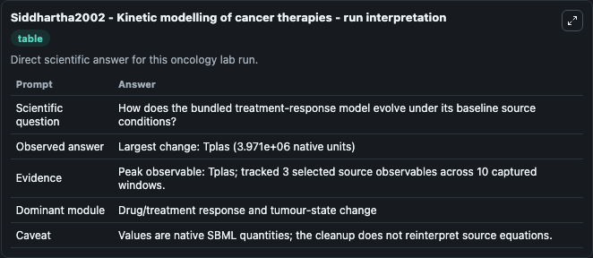
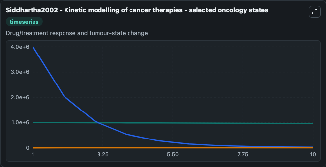
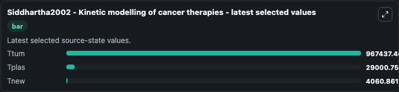

# Siddhartha2002 - Kinetic modelling of cancer therapies

This Biosimulant lab wraps `Siddhartha2002 - Kinetic modelling of cancer therapies` as a runnable oncology model with a companion visualization module.
Siddhartha Jain. It can be used to explore treatment-response dynamics and compare scenario outcomes across configurations.

## What You'll See

The lab asks: How does the bundled treatment-response model evolve under its baseline source conditions? It runs for 10.0 time units with a communication step of 1.0. The run uses the model defaults declared by the curated SBML wrapper. The generated visualizations focus on Ttum, Tplas, and Tnew, combining trajectory, endpoint-comparison, and summary-table views from one completed dark-mode run.

In this captured run, **Tplas** peaked at **4e+06** and **Tplas** moved by **3.97e+06** native units across 10.0 simulation windows.

<!-- BIOSIMULANT_VISUALS_START -->
### Output Visualizations



*Summary table for Siddhartha2002 - Kinetic modelling of cancer therapies, reporting the scientific question, observed answer (largest change: **Tplas** at **3.97e+06** native units), evidence (peak observable: **Tplas**), dominant module, and caveat.*



*Trajectories of Ttum, Tplas, and Tnew across the 10.0 simulation. In this run **Tnew** climbed from 0 to 4060.9 and **Tplas** fell from 4e+06 to 2.9e+04 — the largest movements among the focused observables.*



*Endpoint ranking of the focused observables. Top 3 by final value: **Ttum** = 9.67e+05, **Tplas** = 2.9e+04, **Tnew** = 4060.9.*

<!-- BIOSIMULANT_VISUALS_END -->

## Model Context

- Core model: `models/core`
- Visualization model: `models/visualisation`
- Standard: `other`
- Upstream source: `biomodels_ebi:BIOMD0000001048`
- License: `CC0`
- Visual scope: Drug/treatment response and tumour-state change
- Caveat: Values are native SBML quantities; the cleanup does not reinterpret source equations.

## Inputs

| Input | Maps To | Default | Notes |
|---|---|---|---|
| Ttum | `oncology_sbml_siddhartha2002_kinetic_modelling_of_cancer_thera_biomd0000001048_model.initial_ttum` | `1000000.0` | Initial Ttum. Sets the initial value of bundled SBML symbol `Ttum`. |
| Tplas | `oncology_sbml_siddhartha2002_kinetic_modelling_of_cancer_thera_biomd0000001048_model.initial_tplas` | `4000000.0` | Initial Tplas. Sets the initial value of bundled SBML symbol `Tplas`. |
| Tnew | `oncology_sbml_siddhartha2002_kinetic_modelling_of_cancer_thera_biomd0000001048_model.initial_tnew` | `0.0` | Initial Tnew. Sets the initial value of bundled SBML symbol `Tnew`. |

## Outputs

| Output | Maps To | Role |
|---|---|---|
| `ttum` | `oncology_sbml_siddhartha2002_kinetic_modelling_of_cancer_thera_biomd0000001048_model.ttum` | Ttum observable. |
| `tplas` | `oncology_sbml_siddhartha2002_kinetic_modelling_of_cancer_thera_biomd0000001048_model.tplas` | Tplas observable. |
| `tnew` | `oncology_sbml_siddhartha2002_kinetic_modelling_of_cancer_thera_biomd0000001048_model.tnew` | Tnew observable. |
| `state` | `oncology_sbml_siddhartha2002_kinetic_modelling_of_cancer_thera_biomd0000001048_model.state` | Full raw SBML observable record for reproducibility and downstream visualisation. |
| `summary` | `oncology_sbml_siddhartha2002_kinetic_modelling_of_cancer_thera_biomd0000001048_model.summary` | Change and peak summary across the simulated SBML observables. |
| `species_labels` | `oncology_sbml_siddhartha2002_kinetic_modelling_of_cancer_thera_biomd0000001048_model.species_labels` | Mapping from selected raw SBML observable symbols to display labels. |

## Runtime

- Duration: `10.0`
- Communication step: `1.0`

## Running Locally

```bash
biosimulant labs serve .
```
