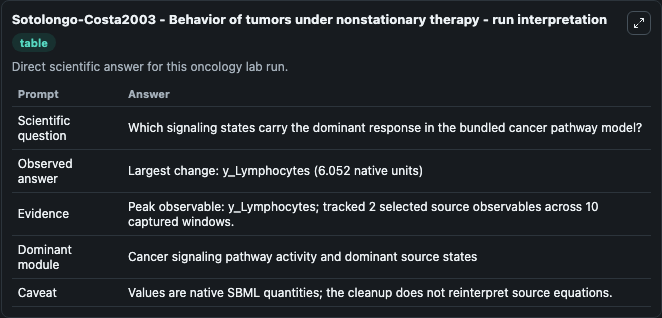
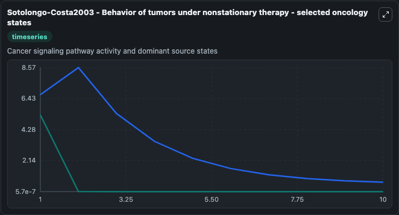
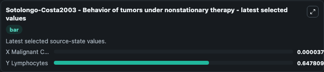

# Sotolongo-Costa2003 - Behavior of tumors under nonstationary therapy

This Biosimulant lab wraps `Sotolongo-Costa2003 - Behavior of tumors under nonstationary therapy` as a runnable oncology model with a companion visualization module.
This model describes the interaction dynamics of a lymphocyte-tumor cell population. It can be used to explore treatment-response dynamics and compare scenario outcomes across configurations.

## What You'll See

The lab asks: Which signaling states carry the dominant response in the bundled cancer pathway model? It runs for 10.0 time units with a communication step of 1.0. The run uses the model defaults declared by the curated SBML wrapper. The generated visualizations focus on X Malignant Cells, and Y Lymphocytes, combining trajectory, endpoint-comparison, and summary-table views from one completed dark-mode run.

In this captured run, **y_Lymphocytes** carried the largest peak and **y_Lymphocytes** moved by **6.052** native units across 10.0 simulation windows.

<!-- BIOSIMULANT_VISUALS_START -->
### Output Visualizations



*Summary table for Sotolongo-Costa2003 - Behavior of tumors under nonstationary therapy, reporting the scientific question, observed answer (largest change: **y_Lymphocytes** at **6.052** native units), evidence (peak observable: **y_Lymphocytes**), dominant module, and caveat.*



*Trajectories of X Malignant Cells, and Y Lymphocytes across the 10.0 simulation. In this run **Y Lymphocytes** fell from 6.700 to 0.6478 — the largest movements among the focused observables.*



*Endpoint ranking of the focused observables. Top 2 by final value: **Y Lymphocytes** = 0.6478, **X Malignant Cells** = 3.75e-05.*

<!-- BIOSIMULANT_VISUALS_END -->

## Model Context

- Core model: `models/core`
- Visualization model: `models/visualisation`
- Standard: `other`
- Upstream source: `biomodels_ebi:BIOMD0000000785`
- License: `CC0`
- Visual scope: Cancer signaling pathway activity and dominant source states
- Caveat: Values are native SBML quantities; the cleanup does not reinterpret source equations.

## Inputs

| Input | Maps To | Default | Notes |
|---|---|---|---|
| X Malignant Cells | `oncology_sbml_sotolongo_costa2003_behavior_of_tumors_under_non_biomd0000000785_model.initial_x_malignant_cells` | `5.3` | Initial X Malignant Cells. Sets the initial value of bundled SBML symbol `x_Malignant_Cells`. |
| Y Lymphocytes | `oncology_sbml_sotolongo_costa2003_behavior_of_tumors_under_non_biomd0000000785_model.initial_y_lymphocytes` | `6.7` | Initial Y Lymphocytes. Sets the initial value of bundled SBML symbol `y_Lymphocytes`. |

## Outputs

| Output | Maps To | Role |
|---|---|---|
| `x_malignant_cells` | `oncology_sbml_sotolongo_costa2003_behavior_of_tumors_under_non_biomd0000000785_model.x_malignant_cells` | X Malignant Cells observable. |
| `y_lymphocytes` | `oncology_sbml_sotolongo_costa2003_behavior_of_tumors_under_non_biomd0000000785_model.y_lymphocytes` | Y Lymphocytes observable. |
| `state` | `oncology_sbml_sotolongo_costa2003_behavior_of_tumors_under_non_biomd0000000785_model.state` | Full raw SBML observable record for reproducibility and downstream visualisation. |
| `summary` | `oncology_sbml_sotolongo_costa2003_behavior_of_tumors_under_non_biomd0000000785_model.summary` | Change and peak summary across the simulated SBML observables. |
| `species_labels` | `oncology_sbml_sotolongo_costa2003_behavior_of_tumors_under_non_biomd0000000785_model.species_labels` | Mapping from selected raw SBML observable symbols to display labels. |

## Runtime

- Duration: `10.0`
- Communication step: `1.0`

## Running Locally

```bash
biosimulant labs serve .
```
