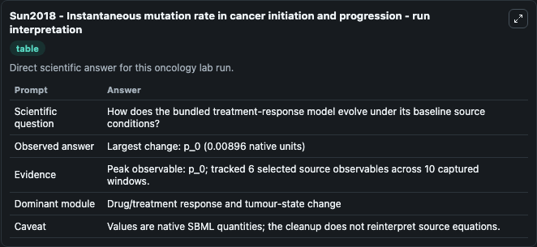
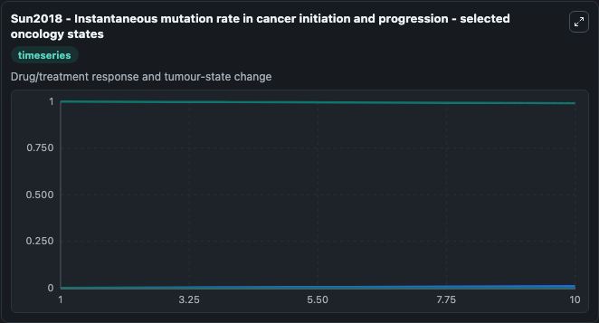
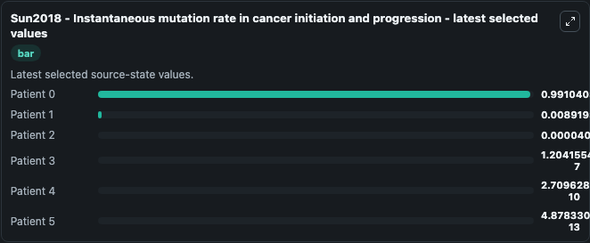

# Sun2018 - Instantaneous mutation rate in cancer initiation and progression

This Biosimulant lab wraps `Sun2018 - Instantaneous mutation rate in cancer initiation and progression` as a runnable oncology model with a companion visualization module.
&lt;notes xmlns=&quot;http://www.sbml.org/sbml/level2/version4&quot;&gt; &lt;body xmlns=&quot;http://www.w3.org/1999/xhtml&quot;&gt; &lt;p&gt;BackgroundCancer is one of the leading causes for the morb. It can be used to explore treatment-response dynamics and compare scenario outcomes across configurations.

## What You'll See

The lab asks: How does the bundled treatment-response model evolve under its baseline source conditions? It runs for 10.0 time units with a communication step of 1.0. The run uses the model defaults declared by the curated SBML wrapper. The generated visualizations focus on Patient 0, Patient 1, Patient 2, Patient 3, Patient 4, and Patient 5, combining trajectory, endpoint-comparison, and summary-table views from one completed dark-mode run.

In this captured run, **p_0** carried the largest peak and **p_0** moved by **0.00896** native units across 10.0 simulation windows.

<!-- BIOSIMULANT_VISUALS_START -->
### Output Visualizations



*Summary table for Sun2018 - Instantaneous mutation rate in cancer initiation and progression, reporting the scientific question, observed answer (largest change: **p_0** at **0.00896** native units), evidence (peak observable: **p_0**), dominant module, and caveat.*



*Trajectories of Patient 0, Patient 1, Patient 2, Patient 3, Patient 4, and Patient 5 across the 10.0 simulation. In this run **Patient 1** climbed from 0 to 0.00892 and **Patient 0** fell from 1.000 to 0.9910 — the largest movements among the focused observables.*



*Endpoint ranking of the focused observables. Top 3 by final value: **Patient 0** = 0.9910, **Patient 1** = 0.00892, **Patient 2** = 4.01e-05, with 3 more observables below.*

<!-- BIOSIMULANT_VISUALS_END -->

## Model Context

- Core model: `models/core`
- Visualization model: `models/visualisation`
- Standard: `other`
- Upstream source: `biomodels_ebi:BIOMD0000000915`
- License: `CC0`
- Visual scope: Drug/treatment response and tumour-state change
- Caveat: Values are native SBML quantities; the cleanup does not reinterpret source equations.

## Inputs

| Input | Maps To | Default | Notes |
|---|---|---|---|
| Patient 0 | `oncology_sbml_sun2018_instantaneous_mutation_rate_in_cancer_in_biomd0000000915_model.initial_patient_0` | `1.0` | Initial Patient 0. Sets the initial value of bundled SBML symbol `p_0`. |
| Patient 1 | `oncology_sbml_sun2018_instantaneous_mutation_rate_in_cancer_in_biomd0000000915_model.initial_patient_1` | `0.0` | Initial Patient 1. Sets the initial value of bundled SBML symbol `p_1`. |
| Patient 2 | `oncology_sbml_sun2018_instantaneous_mutation_rate_in_cancer_in_biomd0000000915_model.initial_patient_2` | `0.0` | Initial Patient 2. Sets the initial value of bundled SBML symbol `p_2`. |
| Patient 3 | `oncology_sbml_sun2018_instantaneous_mutation_rate_in_cancer_in_biomd0000000915_model.initial_patient_3` | `0.0` | Initial Patient 3. Sets the initial value of bundled SBML symbol `p_3`. |
| Patient 4 | `oncology_sbml_sun2018_instantaneous_mutation_rate_in_cancer_in_biomd0000000915_model.initial_patient_4` | `0.0` | Initial Patient 4. Sets the initial value of bundled SBML symbol `p_4`. |
| Patient 5 | `oncology_sbml_sun2018_instantaneous_mutation_rate_in_cancer_in_biomd0000000915_model.initial_patient_5` | `0.0` | Initial Patient 5. Sets the initial value of bundled SBML symbol `p_5`. |

## Outputs

| Output | Maps To | Role |
|---|---|---|
| `patient_0` | `oncology_sbml_sun2018_instantaneous_mutation_rate_in_cancer_in_biomd0000000915_model.patient_0` | Patient 0 observable. |
| `patient_1` | `oncology_sbml_sun2018_instantaneous_mutation_rate_in_cancer_in_biomd0000000915_model.patient_1` | Patient 1 observable. |
| `patient_2` | `oncology_sbml_sun2018_instantaneous_mutation_rate_in_cancer_in_biomd0000000915_model.patient_2` | Patient 2 observable. |
| `patient_3` | `oncology_sbml_sun2018_instantaneous_mutation_rate_in_cancer_in_biomd0000000915_model.patient_3` | Patient 3 observable. |
| `patient_4` | `oncology_sbml_sun2018_instantaneous_mutation_rate_in_cancer_in_biomd0000000915_model.patient_4` | Patient 4 observable. |
| `patient_5` | `oncology_sbml_sun2018_instantaneous_mutation_rate_in_cancer_in_biomd0000000915_model.patient_5` | Patient 5 observable. |
| `state` | `oncology_sbml_sun2018_instantaneous_mutation_rate_in_cancer_in_biomd0000000915_model.state` | Full raw SBML observable record for reproducibility and downstream visualisation. |
| `summary` | `oncology_sbml_sun2018_instantaneous_mutation_rate_in_cancer_in_biomd0000000915_model.summary` | Change and peak summary across the simulated SBML observables. |
| `species_labels` | `oncology_sbml_sun2018_instantaneous_mutation_rate_in_cancer_in_biomd0000000915_model.species_labels` | Mapping from selected raw SBML observable symbols to display labels. |

## Runtime

- Duration: `10.0`
- Communication step: `1.0`

## Running Locally

```bash
biosimulant labs serve .
```
