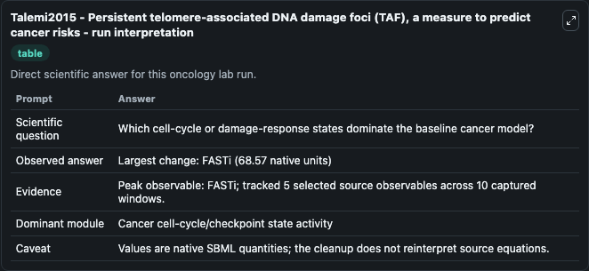
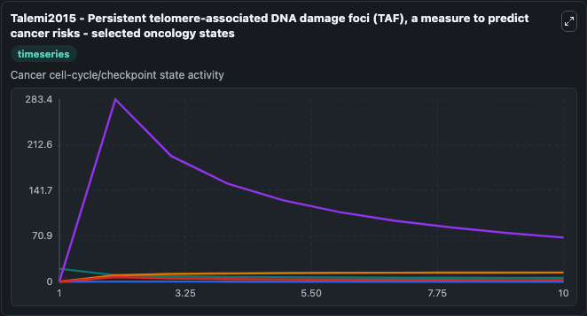
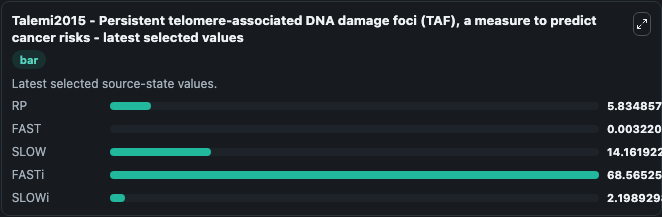

# Talemi2015 - Persistent telomere-associated DNA damage foci (TAF), a measure to predict cancer risks

This Biosimulant lab wraps `Talemi2015 - Persistent telomere-associated DNA damage foci (TAF), a measure to predict cancer risks` as a runnable oncology model with a companion visualization module.
A Robust Model of DNA Damage Dynamics.Rasgou Talemi and Schaber, 12.20.2014. It can be used to explore treatment-response dynamics and compare scenario outcomes across configurations.

## What You'll See

The lab asks: Which cell-cycle or damage-response states dominate the baseline cancer model? It runs for 10.0 time units with a communication step of 1.0. The run uses the model defaults declared by the curated SBML wrapper. The generated visualizations focus on RP, FAST, SLOW, FASTi, and SLOWi, combining trajectory, endpoint-comparison, and summary-table views from one completed dark-mode run.

In this captured run, **FASTi** peaked at **283.4** and **FASTi** moved by **68.570** native units across 10.0 simulation windows.

<!-- BIOSIMULANT_VISUALS_START -->
### Output Visualizations



*Summary table for Talemi2015 - Persistent telomere-associated DNA damage foci (TAF), a measure to predict cancer risks, reporting the scientific question, observed answer (largest change: **FASTi** at **68.570** native units), evidence (peak observable: **FASTi**), dominant module, and caveat.*



*Trajectories of RP, FAST, SLOW, FASTi, and SLOWi across the 10.0 simulation. In this run **FASTi** climbed from 0 to 68.565 and **RP** fell from 20.000 to 5.835 — the largest movements among the focused observables.*



*Endpoint ranking of the focused observables. Top 3 by final value: **FASTi** = 68.565, **SLOW** = 14.162, **RP** = 5.835, with 2 more observables below.*

<!-- BIOSIMULANT_VISUALS_END -->

## Model Context

- Core model: `models/core`
- Visualization model: `models/visualisation`
- Standard: `other`
- Upstream source: `biomodels_ebi:MODEL1412200000`
- License: `CC0`
- Visual scope: Cancer cell-cycle/checkpoint state activity
- Caveat: Values are native SBML quantities; the cleanup does not reinterpret source equations.

## Inputs

| Input | Maps To | Default | Notes |
|---|---|---|---|
| DNAdamagefoci 0 source parameter | `oncology_sbml_talemi2015_persistent_telomere_associated_dna_da_model1412200000_model.dnadamagefoci_0_level` | `750.500039901129` | DNAdamagefoci 0 source parameter. Maps to bundled SBML parameter `DNAdamagefoci_0`. |
| BaseDNAdamage source parameter | `oncology_sbml_talemi2015_persistent_telomere_associated_dna_da_model1412200000_model.basednadamage_level` | `0.989191113985894` | BaseDNAdamage source parameter. Maps to bundled SBML parameter `BaseDNAdamage`. |
| FAST | `oncology_sbml_talemi2015_persistent_telomere_associated_dna_da_model1412200000_model.initial_fast` | `0.0` | Initial FAST. Sets the initial value of bundled SBML symbol `FAST`. |
| SLOW | `oncology_sbml_talemi2015_persistent_telomere_associated_dna_da_model1412200000_model.initial_slow` | `0.0` | Initial SLOW. Sets the initial value of bundled SBML symbol `SLOW`. |
| FASTi | `oncology_sbml_talemi2015_persistent_telomere_associated_dna_da_model1412200000_model.initial_fasti` | `0.0` | Initial FASTi. Sets the initial value of bundled SBML symbol `FASTi`. |
| SLOWi | `oncology_sbml_talemi2015_persistent_telomere_associated_dna_da_model1412200000_model.initial_slowi` | `0.0` | Initial SLOWi. Sets the initial value of bundled SBML symbol `SLOWi`. |

## Outputs

| Output | Maps To | Role |
|---|---|---|
| `model_state_1` | `oncology_sbml_talemi2015_persistent_telomere_associated_dna_da_model1412200000_model.model_state_1` | RP observable. |
| `fast` | `oncology_sbml_talemi2015_persistent_telomere_associated_dna_da_model1412200000_model.fast` | FAST observable. |
| `slow` | `oncology_sbml_talemi2015_persistent_telomere_associated_dna_da_model1412200000_model.slow` | SLOW observable. |
| `fasti` | `oncology_sbml_talemi2015_persistent_telomere_associated_dna_da_model1412200000_model.fasti` | FASTi observable. |
| `slowi` | `oncology_sbml_talemi2015_persistent_telomere_associated_dna_da_model1412200000_model.slowi` | SLOWi observable. |
| `state` | `oncology_sbml_talemi2015_persistent_telomere_associated_dna_da_model1412200000_model.state` | Full raw SBML observable record for reproducibility and downstream visualisation. |
| `summary` | `oncology_sbml_talemi2015_persistent_telomere_associated_dna_da_model1412200000_model.summary` | Change and peak summary across the simulated SBML observables. |
| `species_labels` | `oncology_sbml_talemi2015_persistent_telomere_associated_dna_da_model1412200000_model.species_labels` | Mapping from selected raw SBML observable symbols to display labels. |

## Runtime

- Duration: `10.0`
- Communication step: `1.0`

## Running Locally

```bash
biosimulant labs serve .
```
