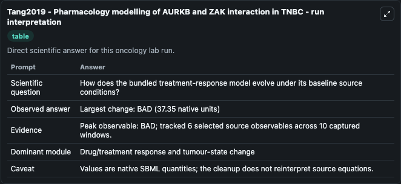
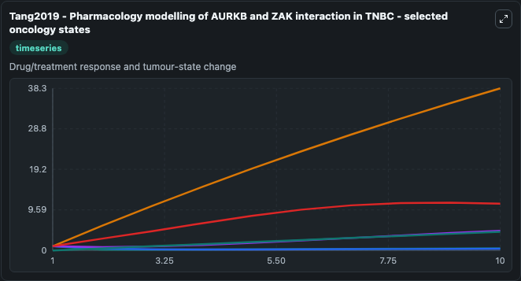
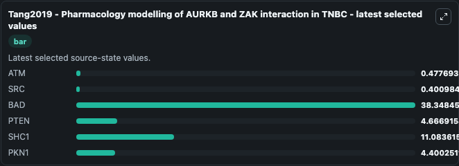

# Tang2019 - Pharmacology modelling of AURKB and ZAK interaction in TNBC

This Biosimulant lab wraps `Tang2019 - Pharmacology modelling of AURKB and ZAK interaction in TNBC` as a runnable oncology model with a companion visualization module.
Aurora Kinase B and ZAK interaction model Equivalent of the stochastic model used in 'Network pharmacology model predicts combined Aurora B and ZAK inhibition in MDA-MB-231 breast cancer cells' by Tan. It can be used to explore treatment-response dynamics and compare scenario outcomes across configurations.

## What You'll See

The lab asks: How does the bundled treatment-response model evolve under its baseline source conditions? It runs for 10.0 time units with a communication step of 1.0. The run uses the model defaults declared by the curated SBML wrapper. The generated visualizations focus on ATM, SRC, BAD, PTEN, SHC1, and PKN1, combining trajectory, endpoint-comparison, and summary-table views from one completed dark-mode run.

In this captured run, **BAD** peaked at **38.348** and **BAD** moved by **37.350** native units across 10.0 simulation windows.

<!-- BIOSIMULANT_VISUALS_START -->
### Output Visualizations



*Summary table for Tang2019 - Pharmacology modelling of AURKB and ZAK interaction in TNBC, reporting the scientific question, observed answer (largest change: **BAD** at **37.350** native units), evidence (peak observable: **BAD**), dominant module, and caveat.*



*Trajectories of ATM, SRC, BAD, PTEN, SHC1, and PKN1 across the 10.0 simulation. In this run **BAD** climbed from 1.000 to 38.348 and **SRC** fell from 1.000 to 0.4010 — the largest movements among the focused observables.*



*Endpoint ranking of the focused observables. Top 3 by final value: **BAD** = 38.348, **SHC1** = 11.084, **PTEN** = 4.667, with 3 more observables below.*

<!-- BIOSIMULANT_VISUALS_END -->

## Model Context

- Core model: `models/core`
- Visualization model: `models/visualisation`
- Standard: `other`
- Upstream source: `biomodels_ebi:BIOMD0000000940`
- License: `CC0`
- Visual scope: Drug/treatment response and tumour-state change
- Caveat: Values are native SBML quantities; the cleanup does not reinterpret source equations.

## Inputs

| Input | Maps To | Default | Notes |
|---|---|---|---|
| Kd tgfbr1 source parameter | `oncology_sbml_tang2019_pharmacology_modelling_of_aurkb_and_zak_biomd0000000940_model.kd_tgfbr1_level` | `0.45` | Kd tgfbr1 source parameter. Maps to bundled SBML parameter `kd_tgfbr1`. |
| K tgfbr1 source parameter | `oncology_sbml_tang2019_pharmacology_modelling_of_aurkb_and_zak_biomd0000000940_model.k_tgfbr1_level` | `0.5` | K tgfbr1 source parameter. Maps to bundled SBML parameter `k_tgfbr1`. |
| ATM | `oncology_sbml_tang2019_pharmacology_modelling_of_aurkb_and_zak_biomd0000000940_model.initial_atm` | `1.0` | Initial ATM. Sets the initial value of bundled SBML symbol `ATM`. |
| SRC | `oncology_sbml_tang2019_pharmacology_modelling_of_aurkb_and_zak_biomd0000000940_model.initial_src` | `1.0` | Initial SRC. Sets the initial value of bundled SBML symbol `SRC`. |
| BAD | `oncology_sbml_tang2019_pharmacology_modelling_of_aurkb_and_zak_biomd0000000940_model.initial_bad` | `1.0` | Initial BAD. Sets the initial value of bundled SBML symbol `BAD`. |
| PTEN | `oncology_sbml_tang2019_pharmacology_modelling_of_aurkb_and_zak_biomd0000000940_model.initial_pten` | `1.0` | Initial PTEN. Sets the initial value of bundled SBML symbol `PTEN`. |

## Outputs

| Output | Maps To | Role |
|---|---|---|
| `atm` | `oncology_sbml_tang2019_pharmacology_modelling_of_aurkb_and_zak_biomd0000000940_model.atm` | ATM observable. |
| `src` | `oncology_sbml_tang2019_pharmacology_modelling_of_aurkb_and_zak_biomd0000000940_model.src` | SRC observable. |
| `bad` | `oncology_sbml_tang2019_pharmacology_modelling_of_aurkb_and_zak_biomd0000000940_model.bad` | BAD observable. |
| `pten` | `oncology_sbml_tang2019_pharmacology_modelling_of_aurkb_and_zak_biomd0000000940_model.pten` | PTEN observable. |
| `shc1` | `oncology_sbml_tang2019_pharmacology_modelling_of_aurkb_and_zak_biomd0000000940_model.shc1` | SHC1 observable. |
| `pkn1` | `oncology_sbml_tang2019_pharmacology_modelling_of_aurkb_and_zak_biomd0000000940_model.pkn1` | PKN1 observable. |
| `state` | `oncology_sbml_tang2019_pharmacology_modelling_of_aurkb_and_zak_biomd0000000940_model.state` | Full raw SBML observable record for reproducibility and downstream visualisation. |
| `summary` | `oncology_sbml_tang2019_pharmacology_modelling_of_aurkb_and_zak_biomd0000000940_model.summary` | Change and peak summary across the simulated SBML observables. |
| `species_labels` | `oncology_sbml_tang2019_pharmacology_modelling_of_aurkb_and_zak_biomd0000000940_model.species_labels` | Mapping from selected raw SBML observable symbols to display labels. |

## Runtime

- Duration: `10.0`
- Communication step: `1.0`

## Running Locally

```bash
biosimulant labs serve .
```
