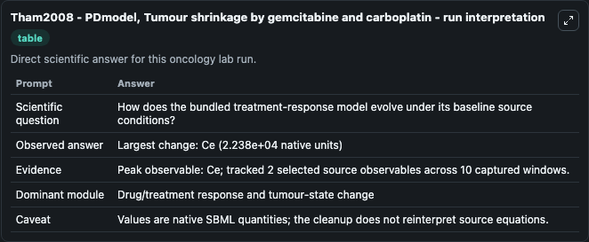
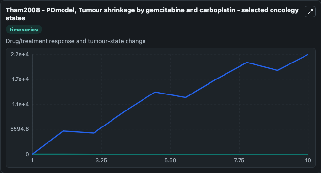
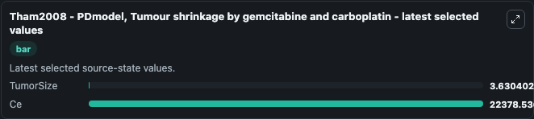

# Tham2008 - PDmodel, Tumour shrinkage by gemcitabine and carboplatin

This Biosimulant lab wraps `Tham2008 - PDmodel, Tumour shrinkage by gemcitabine and carboplatin` as a runnable oncology model with a companion visualization module.
PURPOSE: This tumor response pharmacodynamic model aims to describe primary lesion shrinkage in non-small cell lung cancer over time and determine if concentration-based exposure metrics for gemcitabi. It can be used to explore treatment-response dynamics and compare scenario outcomes across configurations.

## What You'll See

The lab asks: How does the bundled treatment-response model evolve under its baseline source conditions? It runs for 10.0 time units with a communication step of 1.0. The run uses the model defaults declared by the curated SBML wrapper. The generated visualizations focus on TumorSize, and Ce, combining trajectory, endpoint-comparison, and summary-table views from one completed dark-mode run.

In this captured run, **Ce** peaked at **2.24e+04** and **Ce** moved by **2.24e+04** native units across 10.0 simulation windows.

<!-- BIOSIMULANT_VISUALS_START -->
### Output Visualizations



*Summary table for Tham2008 - PDmodel, Tumour shrinkage by gemcitabine and carboplatin, reporting the scientific question, observed answer (largest change: **Ce** at **2.24e+04** native units), evidence (peak observable: **Ce**), dominant module, and caveat.*



*Trajectories of TumorSize, and Ce across the 10.0 simulation. In this run **Ce** climbed from 0 to 2.24e+04 and **TumorSize** fell from 6.660 to 3.630 — the largest movements among the focused observables.*



*Endpoint ranking of the focused observables. Top 2 by final value: **Ce** = 2.24e+04, **TumorSize** = 3.630.*

<!-- BIOSIMULANT_VISUALS_END -->

## Model Context

- Core model: `models/core`
- Visualization model: `models/visualisation`
- Standard: `other`
- Upstream source: `biomodels_ebi:BIOMD0000000234`
- License: `CC0`
- Visual scope: Drug/treatment response and tumour-state change
- Caveat: Values are native SBML quantities; the cleanup does not reinterpret source equations.

## Inputs

| Input | Maps To | Default | Notes |
|---|---|---|---|
| Dose Int2 source parameter | `oncology_sbml_tham2008_pdmodel_tumour_shrinkage_by_gemcitabine_biomd0000000234_model.dose_int2` | `-2.0` | Dose Int2 source parameter. Maps to bundled SBML parameter `Dose_Int2`. |
| Dose Int1 source parameter | `oncology_sbml_tham2008_pdmodel_tumour_shrinkage_by_gemcitabine_biomd0000000234_model.dose_int1` | `0.0` | Dose Int1 source parameter. Maps to bundled SBML parameter `Dose_Int1`. |
| Dose source parameter | `oncology_sbml_tham2008_pdmodel_tumour_shrinkage_by_gemcitabine_biomd0000000234_model.dose` | `5203.84` | Dose source parameter. Maps to bundled SBML parameter `Dose`. |
| TumorSize | `oncology_sbml_tham2008_pdmodel_tumour_shrinkage_by_gemcitabine_biomd0000000234_model.initial_tumorsize` | `6.66` | Initial TumorSize. Sets the initial value of bundled SBML symbol `TumorSize`. |

## Outputs

| Output | Maps To | Role |
|---|---|---|
| `tumorsize` | `oncology_sbml_tham2008_pdmodel_tumour_shrinkage_by_gemcitabine_biomd0000000234_model.tumorsize` | TumorSize observable. |
| `model_state_2` | `oncology_sbml_tham2008_pdmodel_tumour_shrinkage_by_gemcitabine_biomd0000000234_model.model_state_2` | Ce observable. |
| `state` | `oncology_sbml_tham2008_pdmodel_tumour_shrinkage_by_gemcitabine_biomd0000000234_model.state` | Full raw SBML observable record for reproducibility and downstream visualisation. |
| `summary` | `oncology_sbml_tham2008_pdmodel_tumour_shrinkage_by_gemcitabine_biomd0000000234_model.summary` | Change and peak summary across the simulated SBML observables. |
| `species_labels` | `oncology_sbml_tham2008_pdmodel_tumour_shrinkage_by_gemcitabine_biomd0000000234_model.species_labels` | Mapping from selected raw SBML observable symbols to display labels. |

## Runtime

- Duration: `10.0`
- Communication step: `1.0`

## Running Locally

```bash
biosimulant labs serve .
```
