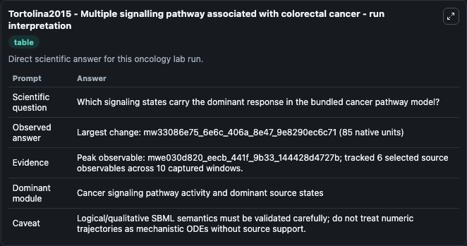
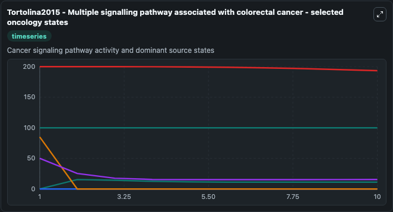
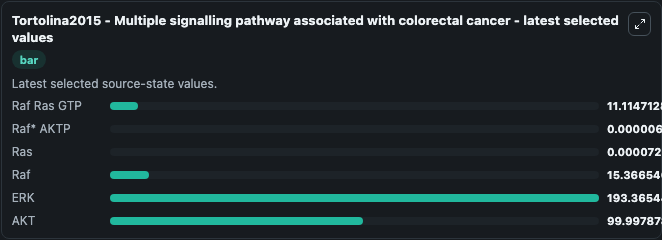

# Tortolina2015 - Multiple signalling pathway associated with colorectal cancer

This Biosimulant lab wraps `Tortolina2015 - Multiple signalling pathway associated with colorectal cancer` as a runnable oncology model with a companion visualization module.
Oncology Tortolina2015Multiple Signalling Pathway Associ Model1601250000Model models core biological dynamics as a OTHER simulation curated from biomodels_ebi (biomodels_ebi:MODEL1601250000), focused on oncolog. It can be used to explore treatment-response dynamics and compare scenario outcomes across configurations.

## What You'll See

The lab asks: Which signaling states carry the dominant response in the bundled cancer pathway model? It runs for 10.0 time units with a communication step of 1.0. The run uses the model defaults declared by the curated SBML wrapper. The generated visualizations focus on Raf Ras GTP, Raf* AKTP, Ras, Raf, ERK, and AKT, combining trajectory, endpoint-comparison, and summary-table views from one completed dark-mode run.

In this captured run, **mwe030d820_eecb_441f_9b33_144428d4727b** carried the largest peak and **mw33086e75_6e6c_406a_8e47_9e8290ec6c71** moved by **85.000** native units across 10.0 simulation windows.

<!-- BIOSIMULANT_VISUALS_START -->
### Output Visualizations



*Summary table for Tortolina2015 - Multiple signalling pathway associated with colorectal cancer, reporting the scientific question, observed answer (largest change: **mw33086e75_6e6c_406a_8e47_9e8290ec6c71** at **85.000** native units), evidence (peak observable: **mwe030d820_eecb_441f_9b33_144428d4727b**), dominant module, and caveat.*



*Trajectories of Raf Ras GTP, Raf* AKTP, Ras, Raf, ERK, and AKT across the 10.0 simulation. In this run **Raf Ras GTP** climbed from 0 to 11.115 and **Ras** fell from 85.000 to 7.29e-05 — the largest movements among the focused observables.*



*Endpoint ranking of the focused observables. Top 3 by final value: **ERK** = 193.4, **AKT** = 99.998, **Raf** = 15.367, with 3 more observables below.*

<!-- BIOSIMULANT_VISUALS_END -->

## Model Context

- Core model: `models/core`
- Visualization model: `models/visualisation`
- Standard: `other`
- Upstream source: `biomodels_ebi:MODEL1601250000`
- License: `CC0`
- Visual scope: Cancer signaling pathway activity and dominant source states
- Caveat: Logical/qualitative SBML semantics must be validated carefully; do not treat numeric trajectories as mechanistic ODEs without source support.

## Inputs

| Input | Maps To | Default | Notes |
|---|---|---|---|
| Raf Ras GTP | `oncology_sbml_tortolina2015_multiple_signalling_pathway_associ_model1601250000_model.initial_raf_ras_gtp` | `0.0` | Initial Raf Ras GTP. Sets the initial value of bundled SBML symbol `mw813e3a30_3dd2_48dc_9b30_f8392d171ad5`. |
| Raf* AKTP | `oncology_sbml_tortolina2015_multiple_signalling_pathway_associ_model1601250000_model.initial_raf_aktp` | `0.0` | Initial Raf* AKTP. Sets the initial value of bundled SBML symbol `mwfabf208d_3879_4a2a_b1dc_568efc0f00d8`. |
| Ras | `oncology_sbml_tortolina2015_multiple_signalling_pathway_associ_model1601250000_model.initial_ras` | `85.0` | Initial Ras. Sets the initial value of bundled SBML symbol `mw33086e75_6e6c_406a_8e47_9e8290ec6c71`. |
| Raf | `oncology_sbml_tortolina2015_multiple_signalling_pathway_associ_model1601250000_model.initial_raf` | `50.0` | Initial Raf. Sets the initial value of bundled SBML symbol `mw020aa876_35fd_48bc_a111_b4d2c8e30189`. |
| ERK | `oncology_sbml_tortolina2015_multiple_signalling_pathway_associ_model1601250000_model.initial_erk` | `200.0` | Initial ERK. Sets the initial value of bundled SBML symbol `mw2b09949a_fc27_4cec_a09a_533d7c925f21`. |
| AKT | `oncology_sbml_tortolina2015_multiple_signalling_pathway_associ_model1601250000_model.initial_akt` | `100.0` | Initial AKT. Sets the initial value of bundled SBML symbol `mwb39c51c6_1b77_4c59_a689_81c9c728255a`. |

## Outputs

| Output | Maps To | Role |
|---|---|---|
| `raf_ras_gtp` | `oncology_sbml_tortolina2015_multiple_signalling_pathway_associ_model1601250000_model.raf_ras_gtp` | Raf Ras GTP observable. |
| `raf_aktp` | `oncology_sbml_tortolina2015_multiple_signalling_pathway_associ_model1601250000_model.raf_aktp` | Raf* AKTP observable. |
| `ras` | `oncology_sbml_tortolina2015_multiple_signalling_pathway_associ_model1601250000_model.ras` | Ras observable. |
| `raf` | `oncology_sbml_tortolina2015_multiple_signalling_pathway_associ_model1601250000_model.raf` | Raf observable. |
| `erk` | `oncology_sbml_tortolina2015_multiple_signalling_pathway_associ_model1601250000_model.erk` | ERK observable. |
| `akt` | `oncology_sbml_tortolina2015_multiple_signalling_pathway_associ_model1601250000_model.akt` | AKT observable. |
| `state` | `oncology_sbml_tortolina2015_multiple_signalling_pathway_associ_model1601250000_model.state` | Full raw SBML observable record for reproducibility and downstream visualisation. |
| `summary` | `oncology_sbml_tortolina2015_multiple_signalling_pathway_associ_model1601250000_model.summary` | Change and peak summary across the simulated SBML observables. |
| `species_labels` | `oncology_sbml_tortolina2015_multiple_signalling_pathway_associ_model1601250000_model.species_labels` | Mapping from selected raw SBML observable symbols to display labels. |

## Runtime

- Duration: `10.0`
- Communication step: `1.0`

## Running Locally

```bash
biosimulant labs serve .
```
