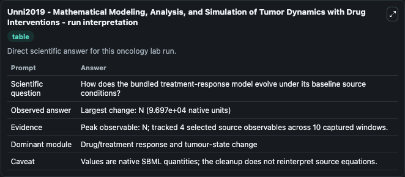
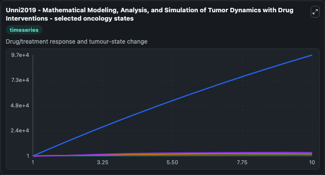
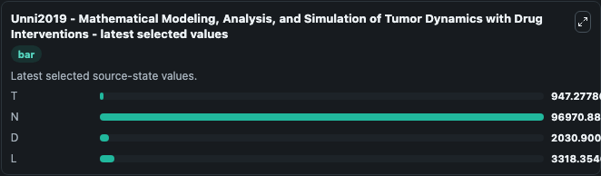

# Unni2019 - Mathematical Modeling, Analysis, and Simulation of Tumor Dynamics with Drug Interventions

This Biosimulant lab wraps `Unni2019 - Mathematical Modeling, Analysis, and Simulation of Tumor Dynamics with Drug Interventions` as a runnable oncology model with a companion visualization module.
Mathematical Modeling, Analysis, and Simulation of Tumor Dynamics with Drug InterventionsPranav Unni 1 and Padmanabhan SeshaiyerAbstractOver the last few decades, there have been significant developme. It can be used to explore treatment-response dynamics and compare scenario outcomes across configurations.

## What You'll See

The lab asks: How does the bundled treatment-response model evolve under its baseline source conditions? It runs for 10.0 time units with a communication step of 1.0. The run uses the model defaults declared by the curated SBML wrapper. The generated visualizations focus on T, N, D, and L, combining trajectory, endpoint-comparison, and summary-table views from one completed dark-mode run.

In this captured run, **N** peaked at **9.7e+04** and **N** moved by **9.7e+04** native units across 10.0 simulation windows.

<!-- BIOSIMULANT_VISUALS_START -->
### Output Visualizations



*Summary table for Unni2019 - Mathematical Modeling, Analysis, and Simulation of Tumor Dynamics with Drug Interventions, reporting the scientific question, observed answer (largest change: **N** at **9.7e+04** native units), evidence (peak observable: **N**), dominant module, and caveat.*



*Trajectories of T, N, D, and L across the 10.0 simulation. In this run **N** climbed from 1.000 to 9.7e+04 — the largest movements among the focused observables.*



*Endpoint ranking of the focused observables. Top 3 by final value: **N** = 9.7e+04, **L** = 3318.4, **D** = 2030.9, with 1 more observable below.*

<!-- BIOSIMULANT_VISUALS_END -->

## Model Context

- Core model: `models/core`
- Visualization model: `models/visualisation`
- Standard: `other`
- Upstream source: `biomodels_ebi:BIOMD0000000888`
- License: `CC0`
- Visual scope: Drug/treatment response and tumour-state change
- Caveat: Values are native SBML quantities; the cleanup does not reinterpret source equations.

## Inputs

| Input | Maps To | Default | Notes |
|---|---|---|---|

## Outputs

| Output | Maps To | Role |
|---|---|---|
| `model_state_1` | `oncology_sbml_unni2019_mathematical_modeling_analysis_and_simu_biomd0000000888_model.model_state_1` | T observable. |
| `model_state_2` | `oncology_sbml_unni2019_mathematical_modeling_analysis_and_simu_biomd0000000888_model.model_state_2` | N observable. |
| `model_state_3` | `oncology_sbml_unni2019_mathematical_modeling_analysis_and_simu_biomd0000000888_model.model_state_3` | D observable. |
| `model_state_4` | `oncology_sbml_unni2019_mathematical_modeling_analysis_and_simu_biomd0000000888_model.model_state_4` | L observable. |
| `state` | `oncology_sbml_unni2019_mathematical_modeling_analysis_and_simu_biomd0000000888_model.state` | Full raw SBML observable record for reproducibility and downstream visualisation. |
| `summary` | `oncology_sbml_unni2019_mathematical_modeling_analysis_and_simu_biomd0000000888_model.summary` | Change and peak summary across the simulated SBML observables. |
| `species_labels` | `oncology_sbml_unni2019_mathematical_modeling_analysis_and_simu_biomd0000000888_model.species_labels` | Mapping from selected raw SBML observable symbols to display labels. |

## Runtime

- Duration: `10.0`
- Communication step: `1.0`

## Running Locally

```bash
biosimulant labs serve .
```
