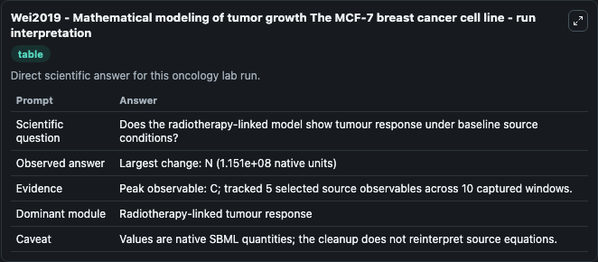
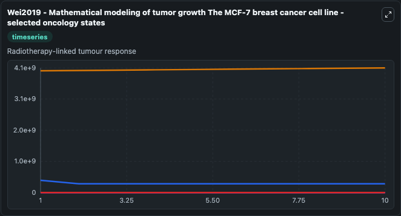
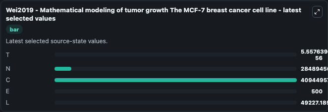

# Wei2019 - Mathematical modeling of tumor growth The MCF-7 breast cancer cell line

This Biosimulant lab wraps `Wei2019 - Mathematical modeling of tumor growth The MCF-7 breast cancer cell line` as a runnable oncology model with a companion visualization module.
This is a mathematical model describing MCF-7 cancer cell growth with interaction between tumor cells, estradiol (hormone-dependent tumor growth), natural killer cells, cytotoxic T lymphocytes and whi. It can be used to explore treatment-response dynamics and compare scenario outcomes across configurations.

## What You'll See

The lab asks: Does the radiotherapy-linked model show tumour response under baseline source conditions? It runs for 10.0 time units with a communication step of 1.0. The run uses the model defaults declared by the curated SBML wrapper. The generated visualizations focus on T, N, C, E, and L, combining trajectory, endpoint-comparison, and summary-table views from one completed dark-mode run.

In this captured run, **C** peaked at **4.09e+09** and **N** moved by **1.15e+08** native units across 10.0 simulation windows.

<!-- BIOSIMULANT_VISUALS_START -->
### Output Visualizations



*Summary table for Wei2019 - Mathematical modeling of tumor growth The MCF-7 breast cancer cell line, reporting the scientific question, observed answer (largest change: **N** at **1.15e+08** native units), evidence (peak observable: **C**), dominant module, and caveat.*



*Trajectories of T, N, C, E, and L across the 10.0 simulation. In this run **C** climbed from 4e+09 to 4.09e+09 and **N** fell from 4e+08 to 2.85e+08 — the largest movements among the focused observables.*



*Endpoint ranking of the focused observables. Top 3 by final value: **C** = 4.09e+09, **N** = 2.85e+08, **L** = 4.92e+04, with 2 more observables below.*

<!-- BIOSIMULANT_VISUALS_END -->

## Model Context

- Core model: `models/core`
- Visualization model: `models/visualisation`
- Standard: `other`
- Upstream source: `biomodels_ebi:MODEL1909090002`
- License: `CC0`
- Visual scope: Radiotherapy-linked tumour response
- Caveat: Values are native SBML quantities; the cleanup does not reinterpret source equations.

## Inputs

| Input | Maps To | Default | Notes |
|---|---|---|---|

## Outputs

| Output | Maps To | Role |
|---|---|---|
| `model_state_1` | `oncology_sbml_wei2019_mathematical_modeling_of_tumor_growth_th_model1909090002_model.model_state_1` | T observable. |
| `model_state_2` | `oncology_sbml_wei2019_mathematical_modeling_of_tumor_growth_th_model1909090002_model.model_state_2` | N observable. |
| `model_state_3` | `oncology_sbml_wei2019_mathematical_modeling_of_tumor_growth_th_model1909090002_model.model_state_3` | C observable. |
| `model_state_4` | `oncology_sbml_wei2019_mathematical_modeling_of_tumor_growth_th_model1909090002_model.model_state_4` | E observable. |
| `model_state_5` | `oncology_sbml_wei2019_mathematical_modeling_of_tumor_growth_th_model1909090002_model.model_state_5` | L observable. |
| `state` | `oncology_sbml_wei2019_mathematical_modeling_of_tumor_growth_th_model1909090002_model.state` | Full raw SBML observable record for reproducibility and downstream visualisation. |
| `summary` | `oncology_sbml_wei2019_mathematical_modeling_of_tumor_growth_th_model1909090002_model.summary` | Change and peak summary across the simulated SBML observables. |
| `species_labels` | `oncology_sbml_wei2019_mathematical_modeling_of_tumor_growth_th_model1909090002_model.species_labels` | Mapping from selected raw SBML observable symbols to display labels. |

## Runtime

- Duration: `10.0`
- Communication step: `1.0`

## Running Locally

```bash
biosimulant labs serve .
```
