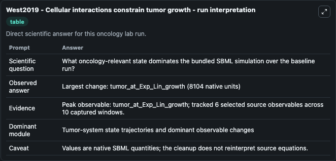
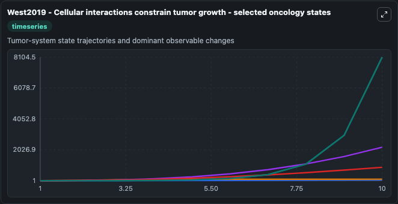
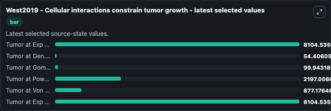

# West2019 - Cellular interactions constrain tumor growth

This Biosimulant lab wraps `West2019 - Cellular interactions constrain tumor growth` as a runnable oncology model with a companion visualization module.
These selections of models are described in the paper:Cellular interactions constrain tumor growthby Jeffrey West and Paul K. It can be used to explore treatment-response dynamics and compare scenario outcomes across configurations.

## What You'll See

The lab asks: What oncology-relevant state dominates the bundled SBML simulation over the baseline run? It runs for 10.0 time units with a communication step of 1.0. The run uses the model defaults declared by the curated SBML wrapper. The generated visualizations focus on Tumor at Exp Lin growth, Tumor at Gen. logistic growth, Tumor at Gomp. growth, Tumor at Power growth, Tumor at Von Bert. growth, and Tumor at Exp growth, combining trajectory, endpoint-comparison, and summary-table views from one completed dark-mode run.

In this captured run, **tumor_at_Exp_Lin_growth** carried the largest peak and **tumor_at_Exp_Lin_growth** moved by **8104.0** native units across 10.0 simulation windows.

<!-- BIOSIMULANT_VISUALS_START -->
### Output Visualizations



*Summary table for West2019 - Cellular interactions constrain tumor growth, reporting the scientific question, observed answer (largest change: **tumor_at_Exp_Lin_growth** at **8104.0** native units), evidence (peak observable: **tumor_at_Exp_Lin_growth**), dominant module, and caveat.*



*Trajectories of Tumor at Exp Lin growth, Tumor at Gen. logistic growth, Tumor at Gomp. growth, Tumor at Power growth, Tumor at Von Bert. growth, and Tumor at Exp growth across the 10.0 simulation. In this run **Tumor at Exp Lin growth** climbed from 1.000 to 8104.5 — the largest movements among the focused observables.*



*Endpoint ranking of the focused observables. Top 3 by final value: **Tumor at Exp Lin growth** = 8104.5, **Tumor at Exp growth** = 8104.5, **Tumor at Power growth** = 2197.0, with 3 more observables below.*

<!-- BIOSIMULANT_VISUALS_END -->

## Model Context

- Core model: `models/core`
- Visualization model: `models/visualisation`
- Standard: `other`
- Upstream source: `biomodels_ebi:BIOMD0000000820`
- License: `CC0`
- Visual scope: Tumor-system state trajectories and dominant observable changes
- Caveat: Values are native SBML quantities; the cleanup does not reinterpret source equations.

## Inputs

| Input | Maps To | Default | Notes |
|---|---|---|---|
| Tumor at Exp Lin growth | `oncology_sbml_west2019_cellular_interactions_constrain_tumor_g_biomd0000000820_model.initial_tumor_at_exp_lin_growth` | `1.0` | Initial Tumor at Exp Lin growth. Sets the initial value of bundled SBML symbol `tumor_at_Exp_Lin_growth`. |
| Tumor at Gen | `oncology_sbml_west2019_cellular_interactions_constrain_tumor_g_biomd0000000820_model.initial_tumor_at_gen_logistic_growth` | `1.0` | Initial Tumor at Gen. logistic growth. Sets the initial value of bundled SBML symbol `tumor_at_Gen__logistic_growth`. |
| Tumor at Gomp | `oncology_sbml_west2019_cellular_interactions_constrain_tumor_g_biomd0000000820_model.initial_tumor_at_gomp_growth` | `1.0` | Initial Tumor at Gomp. growth. Sets the initial value of bundled SBML symbol `tumor_at_Gomp__growth`. |
| Tumor at Power growth | `oncology_sbml_west2019_cellular_interactions_constrain_tumor_g_biomd0000000820_model.initial_tumor_at_power_growth` | `1.0` | Initial Tumor at Power growth. Sets the initial value of bundled SBML symbol `tumor_at_Power_growth`. |
| Tumor at Von Bert | `oncology_sbml_west2019_cellular_interactions_constrain_tumor_g_biomd0000000820_model.initial_tumor_at_von_bert_growth` | `1.0` | Initial Tumor at Von Bert. growth. Sets the initial value of bundled SBML symbol `tumor_at_Von_Bert__growth`. |
| Tumor at Exp growth | `oncology_sbml_west2019_cellular_interactions_constrain_tumor_g_biomd0000000820_model.initial_tumor_at_exp_growth` | `1.0` | Initial Tumor at Exp growth. Sets the initial value of bundled SBML symbol `tumor_at_Exp_growth`. |

## Outputs

| Output | Maps To | Role |
|---|---|---|
| `tumor_at_exp_lin_growth` | `oncology_sbml_west2019_cellular_interactions_constrain_tumor_g_biomd0000000820_model.tumor_at_exp_lin_growth` | Tumor at Exp Lin growth observable. |
| `tumor_at_gen_logistic_growth` | `oncology_sbml_west2019_cellular_interactions_constrain_tumor_g_biomd0000000820_model.tumor_at_gen_logistic_growth` | Tumor at Gen. logistic growth observable. |
| `tumor_at_gomp_growth` | `oncology_sbml_west2019_cellular_interactions_constrain_tumor_g_biomd0000000820_model.tumor_at_gomp_growth` | Tumor at Gomp. growth observable. |
| `tumor_at_power_growth` | `oncology_sbml_west2019_cellular_interactions_constrain_tumor_g_biomd0000000820_model.tumor_at_power_growth` | Tumor at Power growth observable. |
| `tumor_at_von_bert_growth` | `oncology_sbml_west2019_cellular_interactions_constrain_tumor_g_biomd0000000820_model.tumor_at_von_bert_growth` | Tumor at Von Bert. growth observable. |
| `tumor_at_exp_growth` | `oncology_sbml_west2019_cellular_interactions_constrain_tumor_g_biomd0000000820_model.tumor_at_exp_growth` | Tumor at Exp growth observable. |
| `state` | `oncology_sbml_west2019_cellular_interactions_constrain_tumor_g_biomd0000000820_model.state` | Full raw SBML observable record for reproducibility and downstream visualisation. |
| `summary` | `oncology_sbml_west2019_cellular_interactions_constrain_tumor_g_biomd0000000820_model.summary` | Change and peak summary across the simulated SBML observables. |
| `species_labels` | `oncology_sbml_west2019_cellular_interactions_constrain_tumor_g_biomd0000000820_model.species_labels` | Mapping from selected raw SBML observable symbols to display labels. |

## Runtime

- Duration: `10.0`
- Communication step: `1.0`

## Running Locally

```bash
biosimulant labs serve .
```
