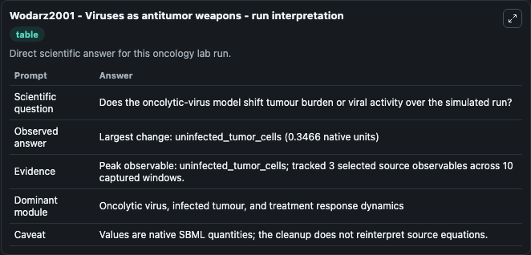
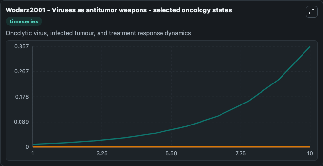
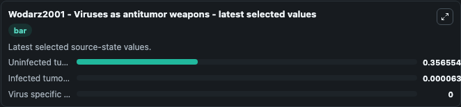

# Wodarz2001 - Viruses as antitumor weapons

This Biosimulant lab wraps `Wodarz2001 - Viruses as antitumor weapons` as a runnable oncology model with a companion visualization module.
This mathematical model of the dynamics between tumor, virus and virus-specific CTL populations is described by the publication:Wodarz D. 'Viruses as antitumor weapons: defining conditions for tumor r. It can be used to explore treatment-response dynamics and compare scenario outcomes across configurations.

## What You'll See

The lab asks: Does the oncolytic-virus model shift tumour burden or viral activity over the simulated run? It runs for 10.0 time units with a communication step of 1.0. The run uses the model defaults declared by the curated SBML wrapper. The generated visualizations focus on Uninfected tumor cells, Infected tumor cells, and Virus specific CTLs, combining trajectory, endpoint-comparison, and summary-table views from one completed dark-mode run.

In this captured run, **uninfected_tumor_cells** carried the largest peak and **uninfected_tumor_cells** moved by **0.3466** native units across 10.0 simulation windows.

<!-- BIOSIMULANT_VISUALS_START -->
### Output Visualizations



*Summary table for Wodarz2001 - Viruses as antitumor weapons, reporting the scientific question, observed answer (largest change: **uninfected_tumor_cells** at **0.3466** native units), evidence (peak observable: **uninfected_tumor_cells**), dominant module, and caveat.*



*Trajectories of Uninfected tumor cells, Infected tumor cells, and Virus specific CTLs across the 10.0 simulation. In this run **Uninfected tumor cells** climbed from 0.0100 to 0.3566 and **Infected tumor cells** fell from 0.0001 to 6.31e-05 — the largest movements among the focused observables.*



*Endpoint ranking of the focused observables. Top 3 by final value: **Uninfected tumor cells** = 0.3566, **Infected tumor cells** = 6.31e-05, **Virus specific CTLs** = 0.*

<!-- BIOSIMULANT_VISUALS_END -->

## Model Context

- Core model: `models/core`
- Visualization model: `models/visualisation`
- Standard: `other`
- Upstream source: `biomodels_ebi:BIOMD0000001043`
- License: `CC0`
- Visual scope: Oncolytic virus, infected tumour, and treatment response dynamics
- Caveat: Values are native SBML quantities; the cleanup does not reinterpret source equations.

## Inputs

| Input | Maps To | Default | Notes |
|---|---|---|---|
| Uninfected tumor cells | `oncology_sbml_wodarz2001_viruses_as_antitumor_weapons_biomd0000001043_model.initial_uninfected_tumor_cells` | `0.01` | Initial Uninfected tumor cells. Sets the initial value of bundled SBML symbol `uninfected_tumor_cells`. |
| Infected tumor cells | `oncology_sbml_wodarz2001_viruses_as_antitumor_weapons_biomd0000001043_model.initial_infected_tumor_cells` | `0.0001` | Initial Infected tumor cells. Sets the initial value of bundled SBML symbol `infected_tumor_cells`. |
| Virus specific CTLs | `oncology_sbml_wodarz2001_viruses_as_antitumor_weapons_biomd0000001043_model.initial_virus_specific_ctls` | `0.0` | Initial Virus specific CTLs. Sets the initial value of bundled SBML symbol `virus_specific_CTLs`. |

## Outputs

| Output | Maps To | Role |
|---|---|---|
| `uninfected_tumor_cells` | `oncology_sbml_wodarz2001_viruses_as_antitumor_weapons_biomd0000001043_model.uninfected_tumor_cells` | Uninfected tumor cells observable. |
| `infected_tumor_cells` | `oncology_sbml_wodarz2001_viruses_as_antitumor_weapons_biomd0000001043_model.infected_tumor_cells` | Infected tumor cells observable. |
| `virus_specific_ctls` | `oncology_sbml_wodarz2001_viruses_as_antitumor_weapons_biomd0000001043_model.virus_specific_ctls` | Virus specific CTLs observable. |
| `state` | `oncology_sbml_wodarz2001_viruses_as_antitumor_weapons_biomd0000001043_model.state` | Full raw SBML observable record for reproducibility and downstream visualisation. |
| `summary` | `oncology_sbml_wodarz2001_viruses_as_antitumor_weapons_biomd0000001043_model.summary` | Change and peak summary across the simulated SBML observables. |
| `species_labels` | `oncology_sbml_wodarz2001_viruses_as_antitumor_weapons_biomd0000001043_model.species_labels` | Mapping from selected raw SBML observable symbols to display labels. |

## Runtime

- Duration: `10.0`
- Communication step: `1.0`

## Running Locally

```bash
biosimulant labs serve .
```
