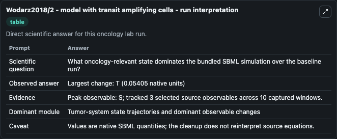
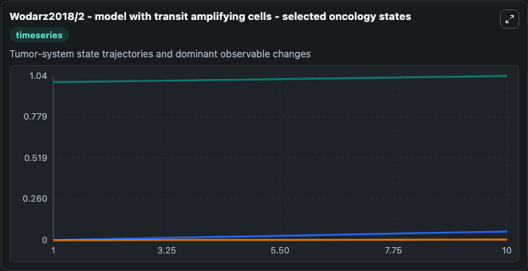
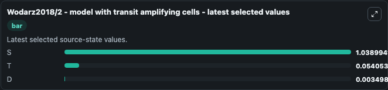

# Wodarz2018/2 - model with transit amplifying cells

This Biosimulant lab wraps `Wodarz2018/2 - model with transit amplifying cells` as a runnable oncology model with a companion visualization module.
The paper describes a model of effect of cellular de-differentiation on the dynamics and evolution of tissue and tumor cells. It can be used to explore treatment-response dynamics and compare scenario outcomes across configurations.

## What You'll See

The lab asks: What oncology-relevant state dominates the bundled SBML simulation over the baseline run? It runs for 10.0 time units with a communication step of 1.0. The run uses the model defaults declared by the curated SBML wrapper. The generated visualizations focus on S, T, and D, combining trajectory, endpoint-comparison, and summary-table views from one completed dark-mode run.

In this captured run, **S** peaked at **1.039** and **T** moved by **0.0541** native units across 10.0 simulation windows.

<!-- BIOSIMULANT_VISUALS_START -->
### Output Visualizations



*Summary table for Wodarz2018/2 - model with transit amplifying cells, reporting the scientific question, observed answer (largest change: **T** at **0.0541** native units), evidence (peak observable: **S**), dominant module, and caveat.*



*Trajectories of S, T, and D across the 10.0 simulation. In this run **T** climbed from 0 to 0.0541 — the largest movements among the focused observables.*



*Endpoint ranking of the focused observables. Top 3 by final value: **S** = 1.039, **T** = 0.0541, **D** = 0.0035.*

<!-- BIOSIMULANT_VISUALS_END -->

## Model Context

- Core model: `models/core`
- Visualization model: `models/visualisation`
- Standard: `other`
- Upstream source: `biomodels_ebi:BIOMD0000000773`
- License: `CC0`
- Visual scope: Tumor-system state trajectories and dominant observable changes
- Caveat: Values are native SBML quantities; the cleanup does not reinterpret source equations.

## Inputs

| Input | Maps To | Default | Notes |
|---|---|---|---|

## Outputs

| Output | Maps To | Role |
|---|---|---|
| `model_state_1` | `oncology_sbml_wodarz2018_2_model_with_transit_amplifying_cells_biomd0000000773_model.model_state_1` | S observable. |
| `model_state_2` | `oncology_sbml_wodarz2018_2_model_with_transit_amplifying_cells_biomd0000000773_model.model_state_2` | T observable. |
| `model_state_3` | `oncology_sbml_wodarz2018_2_model_with_transit_amplifying_cells_biomd0000000773_model.model_state_3` | D observable. |
| `state` | `oncology_sbml_wodarz2018_2_model_with_transit_amplifying_cells_biomd0000000773_model.state` | Full raw SBML observable record for reproducibility and downstream visualisation. |
| `summary` | `oncology_sbml_wodarz2018_2_model_with_transit_amplifying_cells_biomd0000000773_model.summary` | Change and peak summary across the simulated SBML observables. |
| `species_labels` | `oncology_sbml_wodarz2018_2_model_with_transit_amplifying_cells_biomd0000000773_model.species_labels` | Mapping from selected raw SBML observable symbols to display labels. |

## Runtime

- Duration: `10.0`
- Communication step: `1.0`

## Running Locally

```bash
biosimulant labs serve .
```
