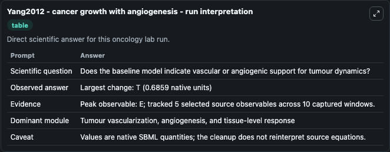
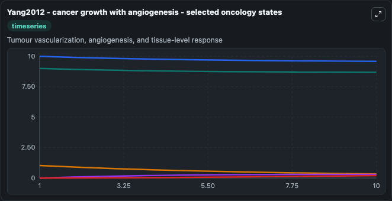
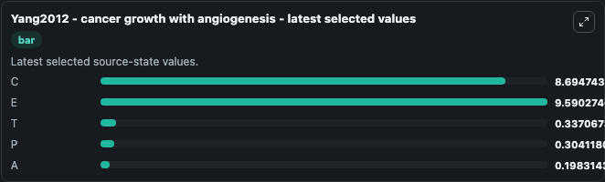

# Yang2012 - cancer growth with angiogenesis

This Biosimulant lab wraps `Yang2012 - cancer growth with angiogenesis` as a runnable oncology model with a companion visualization module.
The paper describes a model of tumor growth with angiogenesis. It can be used to explore treatment-response dynamics and compare scenario outcomes across configurations.

## What You'll See

The lab asks: Does the baseline model indicate vascular or angiogenic support for tumour dynamics? It runs for 10.0 time units with a communication step of 1.0. The run uses the model defaults declared by the curated SBML wrapper. The generated visualizations focus on C, E, T, P, and A, combining trajectory, endpoint-comparison, and summary-table views from one completed dark-mode run.

In this captured run, **E** peaked at **10.000** and **T** moved by **0.6859** native units across 10.0 simulation windows.

<!-- BIOSIMULANT_VISUALS_START -->
### Output Visualizations



*Summary table for Yang2012 - cancer growth with angiogenesis, reporting the scientific question, observed answer (largest change: **T** at **0.6859** native units), evidence (peak observable: **E**), dominant module, and caveat.*



*Trajectories of C, E, T, P, and A across the 10.0 simulation. In this run **P** climbed from 0 to 0.3041 and **T** fell from 1.023 to 0.3371 — the largest movements among the focused observables.*



*Endpoint ranking of the focused observables. Top 3 by final value: **E** = 9.590, **C** = 8.695, **T** = 0.3371, with 2 more observables below.*

<!-- BIOSIMULANT_VISUALS_END -->

## Model Context

- Core model: `models/core`
- Visualization model: `models/visualisation`
- Standard: `other`
- Upstream source: `biomodels_ebi:BIOMD0000000796`
- License: `CC0`
- Visual scope: Tumour vascularization, angiogenesis, and tissue-level response
- Caveat: Values are native SBML quantities; the cleanup does not reinterpret source equations.

## Inputs

| Input | Maps To | Default | Notes |
|---|---|---|---|

## Outputs

| Output | Maps To | Role |
|---|---|---|
| `model_state_1` | `oncology_sbml_yang2012_cancer_growth_with_angiogenesis_biomd0000000796_model.model_state_1` | C observable. |
| `model_state_2` | `oncology_sbml_yang2012_cancer_growth_with_angiogenesis_biomd0000000796_model.model_state_2` | E observable. |
| `model_state_3` | `oncology_sbml_yang2012_cancer_growth_with_angiogenesis_biomd0000000796_model.model_state_3` | T observable. |
| `model_state_4` | `oncology_sbml_yang2012_cancer_growth_with_angiogenesis_biomd0000000796_model.model_state_4` | P observable. |
| `model_state_5` | `oncology_sbml_yang2012_cancer_growth_with_angiogenesis_biomd0000000796_model.model_state_5` | A observable. |
| `state` | `oncology_sbml_yang2012_cancer_growth_with_angiogenesis_biomd0000000796_model.state` | Full raw SBML observable record for reproducibility and downstream visualisation. |
| `summary` | `oncology_sbml_yang2012_cancer_growth_with_angiogenesis_biomd0000000796_model.summary` | Change and peak summary across the simulated SBML observables. |
| `species_labels` | `oncology_sbml_yang2012_cancer_growth_with_angiogenesis_biomd0000000796_model.species_labels` | Mapping from selected raw SBML observable symbols to display labels. |

## Runtime

- Duration: `10.0`
- Communication step: `1.0`

## Running Locally

```bash
biosimulant labs serve .
```
