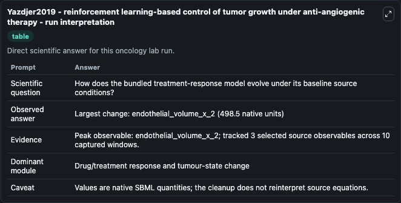
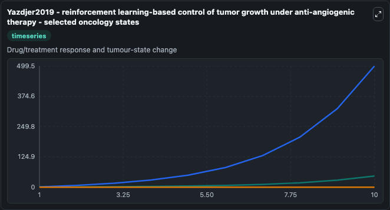
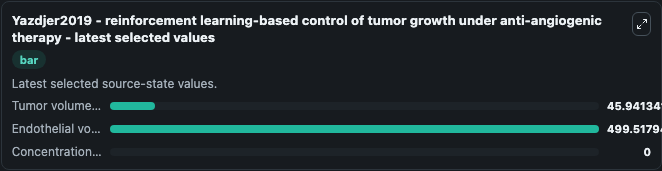

# Yazdjer2019 - reinforcement learning-based control of tumor growth under anti-angiogenic therapy

This Biosimulant lab wraps `Yazdjer2019 - reinforcement learning-based control of tumor growth under anti-angiogenic therapy` as a runnable oncology model with a companion visualization module.
This model is based on:Reinforcement learning-based control of tumor growth under anti-angiogenic therapyAuthors: Parisa Yazdjerdi, Nader Meskin, Mohammad Al-Naemi, Ala-Eddin Al Moustafa, Levente Kova. It can be used to explore treatment-response dynamics and compare scenario outcomes across configurations.

## What You'll See

The lab asks: How does the bundled treatment-response model evolve under its baseline source conditions? It runs for 10.0 time units with a communication step of 1.0. The run uses the model defaults declared by the curated SBML wrapper. The generated visualizations focus on Tumor volume x 1, Endothelial volume x 2, and Concentration of administrated inhibitor x 3, combining trajectory, endpoint-comparison, and summary-table views from one completed dark-mode run.

In this captured run, **endothelial_volume_x_2** carried the largest peak and **endothelial_volume_x_2** moved by **498.5** native units across 10.0 simulation windows.

<!-- BIOSIMULANT_VISUALS_START -->
### Output Visualizations



*Summary table for Yazdjer2019 - reinforcement learning-based control of tumor growth under anti-angiogenic therapy, reporting the scientific question, observed answer (largest change: **endothelial_volume_x_2** at **498.5** native units), evidence (peak observable: **endothelial_volume_x_2**), dominant module, and caveat.*



*Trajectories of Tumor volume x 1, Endothelial volume x 2, and Concentration of administrated inhibitor x 3 across the 10.0 simulation. In this run **Endothelial volume x 2** climbed from 1.000 to 499.5 — the largest movements among the focused observables.*



*Endpoint ranking of the focused observables. Top 3 by final value: **Endothelial volume x 2** = 499.5, **Tumor volume x 1** = 45.941, **Concentration of administrated inhibitor x 3** = 0.*

<!-- BIOSIMULANT_VISUALS_END -->

## Model Context

- Core model: `models/core`
- Visualization model: `models/visualisation`
- Standard: `other`
- Upstream source: `biomodels_ebi:BIOMD0000000821`
- License: `CC0`
- Visual scope: Drug/treatment response and tumour-state change
- Caveat: Values are native SBML quantities; the cleanup does not reinterpret source equations.

## Inputs

| Input | Maps To | Default | Notes |
|---|---|---|---|
| Tumor volume x 1 | `oncology_sbml_yazdjer2019_reinforcement_learning_based_control_biomd0000000821_model.initial_tumor_volume_x_1` | `1.0` | Initial Tumor volume x 1. Sets the initial value of bundled SBML symbol `tumor_volume_x_1`. |
| Endothelial volume x 2 | `oncology_sbml_yazdjer2019_reinforcement_learning_based_control_biomd0000000821_model.initial_endothelial_volume_x_2` | `1.0` | Initial Endothelial volume x 2. Sets the initial value of bundled SBML symbol `endothelial_volume_x_2`. |
| Concentration of administrated inhibitor x 3 | `oncology_sbml_yazdjer2019_reinforcement_learning_based_control_biomd0000000821_model.initial_concentration_of_administrated_inhibitor_x_3` | `0.0` | Initial Concentration of administrated inhibitor x 3. Sets the initial value of bundled SBML symbol `concentration_of_administrated_inhibitor_x_3`. |

## Outputs

| Output | Maps To | Role |
|---|---|---|
| `tumor_volume_x_1` | `oncology_sbml_yazdjer2019_reinforcement_learning_based_control_biomd0000000821_model.tumor_volume_x_1` | Tumor volume x 1 observable. |
| `endothelial_volume_x_2` | `oncology_sbml_yazdjer2019_reinforcement_learning_based_control_biomd0000000821_model.endothelial_volume_x_2` | Endothelial volume x 2 observable. |
| `concentration_of_administrated_inhibitor_x_3` | `oncology_sbml_yazdjer2019_reinforcement_learning_based_control_biomd0000000821_model.concentration_of_administrated_inhibitor_x_3` | Concentration of administrated inhibitor x 3 observable. |
| `state` | `oncology_sbml_yazdjer2019_reinforcement_learning_based_control_biomd0000000821_model.state` | Full raw SBML observable record for reproducibility and downstream visualisation. |
| `summary` | `oncology_sbml_yazdjer2019_reinforcement_learning_based_control_biomd0000000821_model.summary` | Change and peak summary across the simulated SBML observables. |
| `species_labels` | `oncology_sbml_yazdjer2019_reinforcement_learning_based_control_biomd0000000821_model.species_labels` | Mapping from selected raw SBML observable symbols to display labels. |

## Runtime

- Duration: `10.0`
- Communication step: `1.0`

## Running Locally

```bash
biosimulant labs serve .
```
