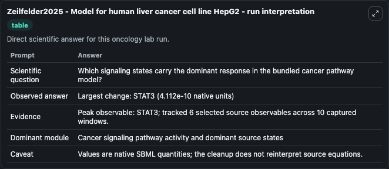
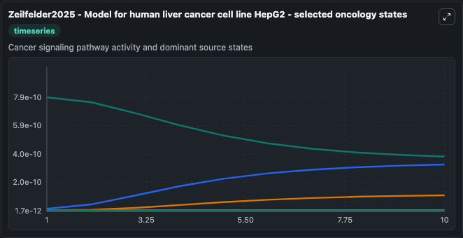
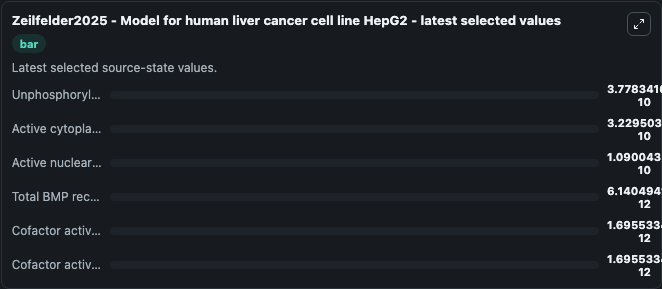

# Zeilfelder2025 - Model for human liver cancer cell line HepG2

This Biosimulant lab wraps `Zeilfelder2025 - Model for human liver cancer cell line HepG2` as a runnable oncology model with a companion visualization module.
Mathematical multi-compartment model described by sets of coupledordinary differential equations (ODEs) for studying the IL6 and SMAD signaling in HepG2 human cancer cell lines. It can be used to explore treatment-response dynamics and compare scenario outcomes across configurations.

## What You'll See

The lab asks: Which signaling states carry the dominant response in the bundled cancer pathway model? It runs for 10.0 time units with a communication step of 1.0. The run uses the model defaults declared by the curated SBML wrapper. The generated visualizations focus on Unphosphorylated STAT3, Active cytoplasmic STAT3, Active nuclear STAT3, Total BMP receptor, Cofactor activated by BMP receptor, and Cofactor activated by BMP receptor 2, combining trajectory, endpoint-comparison, and summary-table views from one completed dark-mode run.

In this captured run, **STAT3** carried the largest peak and **STAT3** moved by **4.11e-10** native units across 10.0 simulation windows.

<!-- BIOSIMULANT_VISUALS_START -->
### Output Visualizations



*Summary table for Zeilfelder2025 - Model for human liver cancer cell line HepG2, reporting the scientific question, observed answer (largest change: **STAT3** at **4.11e-10** native units), evidence (peak observable: **STAT3**), dominant module, and caveat.*



*Trajectories of Unphosphorylated STAT3, Active cytoplasmic STAT3, Active nuclear STAT3, Total BMP receptor, Cofactor activated by BMP receptor, and Cofactor activated by BMP receptor 2 across the 10.0 simulation. In this run **Active cytoplasmic STAT3** climbed from 1.54e-11 to 3.23e-10 and **Unphosphorylated STAT3** fell from 7.89e-10 to 3.78e-10 — the largest movements among the focused observables.*



*Endpoint ranking of the focused observables. Top 3 by final value: **Unphosphorylated STAT3** = 3.78e-10, **Active cytoplasmic STAT3** = 3.23e-10, **Active nuclear STAT3** = 1.09e-10, with 3 more observables below.*

<!-- BIOSIMULANT_VISUALS_END -->

## Model Context

- Core model: `models/core`
- Visualization model: `models/visualisation`
- Standard: `other`
- Upstream source: `biomodels_ebi:MODEL2503270001`
- License: `CC0`
- Visual scope: Cancer signaling pathway activity and dominant source states
- Caveat: Values are native SBML quantities; the cleanup does not reinterpret source equations.

## Inputs

| Input | Maps To | Default | Notes |
|---|---|---|---|
| Input il6 source parameter | `oncology_sbml_zeilfelder2025_model_for_human_liver_cancer_cell_model2503270001_model.input_il6_level` | `10.0` | Input il6 source parameter. Maps to bundled SBML parameter `input_il6`. |
| Il6 basal source parameter | `oncology_sbml_zeilfelder2025_model_for_human_liver_cancer_cell_model2503270001_model.il6_basal_level` | `0.00957067090828757` | Il6 basal source parameter. Maps to bundled SBML parameter `il6_basal`. |
| Il6 act source parameter | `oncology_sbml_zeilfelder2025_model_for_human_liver_cancer_cell_model2503270001_model.il6_act_level` | `0.0226985677410744` | Il6 act source parameter. Maps to bundled SBML parameter `il6_act`. |
| Dcf il6 basal source parameter | `oncology_sbml_zeilfelder2025_model_for_human_liver_cancer_cell_model2503270001_model.dcf_il6_basal_level` | `0.835096746625705` | Dcf il6 basal source parameter. Maps to bundled SBML parameter `dcf_il6_basal`. |
| Unphosphorylated STAT3 | `oncology_sbml_zeilfelder2025_model_for_human_liver_cancer_cell_model2503270001_model.initial_unphosphorylated_stat3` | `1237.76392668883` | Initial Unphosphorylated STAT3. Sets the initial value of bundled SBML symbol `STAT3`. |
| Active cytoplasmic STAT3 | `oncology_sbml_zeilfelder2025_model_for_human_liver_cancer_cell_model2503270001_model.initial_active_cytoplasmic_stat3` | `24.1373740148803` | Initial Active cytoplasmic STAT3. Sets the initial value of bundled SBML symbol `cpSTAT3`. |

## Outputs

| Output | Maps To | Role |
|---|---|---|
| `unphosphorylated_stat3` | `oncology_sbml_zeilfelder2025_model_for_human_liver_cancer_cell_model2503270001_model.unphosphorylated_stat3` | Unphosphorylated STAT3 observable. |
| `active_cytoplasmic_stat3` | `oncology_sbml_zeilfelder2025_model_for_human_liver_cancer_cell_model2503270001_model.active_cytoplasmic_stat3` | Active cytoplasmic STAT3 observable. |
| `active_nuclear_stat3` | `oncology_sbml_zeilfelder2025_model_for_human_liver_cancer_cell_model2503270001_model.active_nuclear_stat3` | Active nuclear STAT3 observable. |
| `total_bmp_receptor` | `oncology_sbml_zeilfelder2025_model_for_human_liver_cancer_cell_model2503270001_model.total_bmp_receptor` | Total BMP receptor observable. |
| `cofactor_activated_by_bmp_receptor` | `oncology_sbml_zeilfelder2025_model_for_human_liver_cancer_cell_model2503270001_model.cofactor_activated_by_bmp_receptor` | Cofactor activated by BMP receptor observable. |
| `cofactor_activated_by_bmp_receptor_2` | `oncology_sbml_zeilfelder2025_model_for_human_liver_cancer_cell_model2503270001_model.cofactor_activated_by_bmp_receptor_2` | Cofactor activated by BMP receptor 2 observable. |
| `state` | `oncology_sbml_zeilfelder2025_model_for_human_liver_cancer_cell_model2503270001_model.state` | Full raw SBML observable record for reproducibility and downstream visualisation. |
| `summary` | `oncology_sbml_zeilfelder2025_model_for_human_liver_cancer_cell_model2503270001_model.summary` | Change and peak summary across the simulated SBML observables. |
| `species_labels` | `oncology_sbml_zeilfelder2025_model_for_human_liver_cancer_cell_model2503270001_model.species_labels` | Mapping from selected raw SBML observable symbols to display labels. |

## Runtime

- Duration: `10.0`
- Communication step: `1.0`

## Running Locally

```bash
biosimulant labs serve .
```
