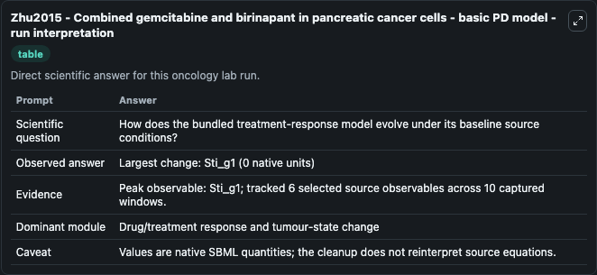
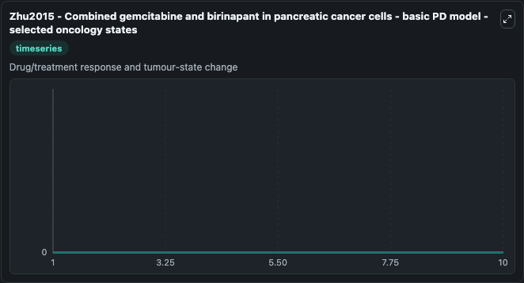
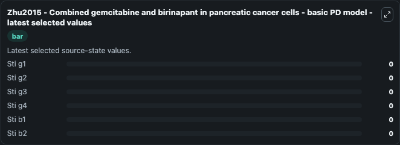

# Zhu2015 - Combined gemcitabine and birinapant in pancreatic cancer cells - basic PD model

This Biosimulant lab wraps `Zhu2015 - Combined gemcitabine and birinapant in pancreatic cancer cells - basic PD model` as a runnable oncology model with a companion visualization module.
Zhu2015 - Combined gemcitabine and birinapantin pancreatic cancer cells - basic PD model Mathematical model to illustrate theeffectiveness of combination chemotherapy involving gemcitabine andbirinapa. It can be used to explore treatment-response dynamics and compare scenario outcomes across configurations.

## What You'll See

The lab asks: How does the bundled treatment-response model evolve under its baseline source conditions? It runs for 10.0 time units with a communication step of 1.0. The run uses the model defaults declared by the curated SBML wrapper. The generated visualizations focus on Sti g1, Sti g2, Sti g3, Sti g4, Sti b1, and Sti b2, combining trajectory, endpoint-comparison, and summary-table views from one completed dark-mode run.

In this captured run, **Sti_g1** carried the largest peak and **Sti_g1** moved by **0** native units across 10.0 simulation windows.

<!-- BIOSIMULANT_VISUALS_START -->
### Output Visualizations



*Summary table for Zhu2015 - Combined gemcitabine and birinapant in pancreatic cancer cells - basic PD model, reporting the scientific question, observed answer (largest change: **Sti_g1** at **0** native units), evidence (peak observable: **Sti_g1**), dominant module, and caveat.*



*Trajectories of Sti g1, Sti g2, Sti g3, Sti g4, Sti b1, and Sti b2 across the 10.0 simulation. In this run Sti g1, Sti g2, Sti g3, Sti g4 stayed near their initial values — no observable moved appreciably.*



*Endpoint ranking of the focused observables. Top 3 by final value: **Sti g1** = 0, **Sti g2** = 0, **Sti g3** = 0, with 3 more observables below.*

<!-- BIOSIMULANT_VISUALS_END -->

## Model Context

- Core model: `models/core`
- Visualization model: `models/visualisation`
- Standard: `other`
- Upstream source: `biomodels_ebi:BIOMD0000000668`
- License: `CC0`
- Visual scope: Drug/treatment response and tumour-state change
- Caveat: Values are native SBML quantities; the cleanup does not reinterpret source equations.

## Inputs

| Input | Maps To | Default | Notes |
|---|---|---|---|
| Sti g1 | `oncology_sbml_zhu2015_combined_gemcitabine_and_birinapant_in_p_biomd0000000668_model.initial_sti_g1` | `0.0` | Initial Sti g1. Sets the initial value of bundled SBML symbol `Sti_g1`. |
| Sti g2 | `oncology_sbml_zhu2015_combined_gemcitabine_and_birinapant_in_p_biomd0000000668_model.initial_sti_g2` | `0.0` | Initial Sti g2. Sets the initial value of bundled SBML symbol `Sti_g2`. |
| Sti g3 | `oncology_sbml_zhu2015_combined_gemcitabine_and_birinapant_in_p_biomd0000000668_model.initial_sti_g3` | `0.0` | Initial Sti g3. Sets the initial value of bundled SBML symbol `Sti_g3`. |
| Sti g4 | `oncology_sbml_zhu2015_combined_gemcitabine_and_birinapant_in_p_biomd0000000668_model.initial_sti_g4` | `0.0` | Initial Sti g4. Sets the initial value of bundled SBML symbol `Sti_g4`. |
| Sti b1 | `oncology_sbml_zhu2015_combined_gemcitabine_and_birinapant_in_p_biomd0000000668_model.initial_sti_b1` | `0.0` | Initial Sti b1. Sets the initial value of bundled SBML symbol `Sti_b1`. |
| Sti b2 | `oncology_sbml_zhu2015_combined_gemcitabine_and_birinapant_in_p_biomd0000000668_model.initial_sti_b2` | `0.0` | Initial Sti b2. Sets the initial value of bundled SBML symbol `Sti_b2`. |

## Outputs

| Output | Maps To | Role |
|---|---|---|
| `sti_g1` | `oncology_sbml_zhu2015_combined_gemcitabine_and_birinapant_in_p_biomd0000000668_model.sti_g1` | Sti g1 observable. |
| `sti_g2` | `oncology_sbml_zhu2015_combined_gemcitabine_and_birinapant_in_p_biomd0000000668_model.sti_g2` | Sti g2 observable. |
| `sti_g3` | `oncology_sbml_zhu2015_combined_gemcitabine_and_birinapant_in_p_biomd0000000668_model.sti_g3` | Sti g3 observable. |
| `sti_g4` | `oncology_sbml_zhu2015_combined_gemcitabine_and_birinapant_in_p_biomd0000000668_model.sti_g4` | Sti g4 observable. |
| `sti_b1` | `oncology_sbml_zhu2015_combined_gemcitabine_and_birinapant_in_p_biomd0000000668_model.sti_b1` | Sti b1 observable. |
| `sti_b2` | `oncology_sbml_zhu2015_combined_gemcitabine_and_birinapant_in_p_biomd0000000668_model.sti_b2` | Sti b2 observable. |
| `state` | `oncology_sbml_zhu2015_combined_gemcitabine_and_birinapant_in_p_biomd0000000668_model.state` | Full raw SBML observable record for reproducibility and downstream visualisation. |
| `summary` | `oncology_sbml_zhu2015_combined_gemcitabine_and_birinapant_in_p_biomd0000000668_model.summary` | Change and peak summary across the simulated SBML observables. |
| `species_labels` | `oncology_sbml_zhu2015_combined_gemcitabine_and_birinapant_in_p_biomd0000000668_model.species_labels` | Mapping from selected raw SBML observable symbols to display labels. |

## Runtime

- Duration: `10.0`
- Communication step: `1.0`

## Running Locally

```bash
biosimulant labs serve .
```
