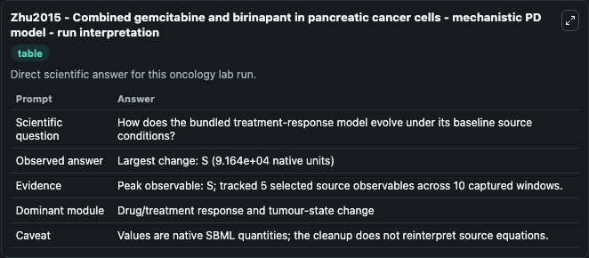
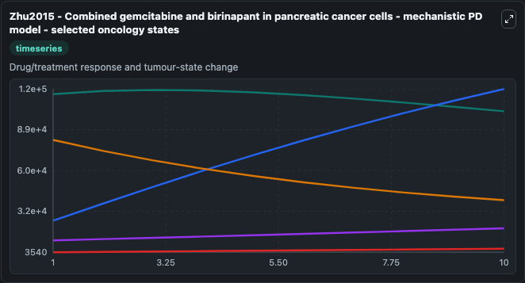
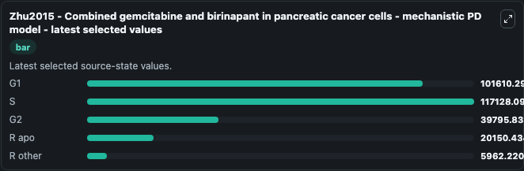

# Zhu2015 - Combined gemcitabine and birinapant in pancreatic cancer cells - mechanistic PD model

This Biosimulant lab wraps `Zhu2015 - Combined gemcitabine and birinapant in pancreatic cancer cells - mechanistic PD model` as a runnable oncology model with a companion visualization module.
Zhu2015 - combined gemcitabine and birinapantin pancreatic cancer cells - mechanistic PD model Mechanistic mathematical model toillustrate the effectiveness of combination chemotherapy involvinggemcit. It can be used to explore treatment-response dynamics and compare scenario outcomes across configurations.

## What You'll See

The lab asks: How does the bundled treatment-response model evolve under its baseline source conditions? It runs for 10.0 time units with a communication step of 1.0. The run uses the model defaults declared by the curated SBML wrapper. The generated visualizations focus on G1, S, G2, R apo, and R other, combining trajectory, endpoint-comparison, and summary-table views from one completed dark-mode run.

In this captured run, **S** peaked at **1.17e+05** and **S** moved by **9.16e+04** native units across 10.0 simulation windows.

<!-- BIOSIMULANT_VISUALS_START -->
### Output Visualizations



*Summary table for Zhu2015 - Combined gemcitabine and birinapant in pancreatic cancer cells - mechanistic PD model, reporting the scientific question, observed answer (largest change: **S** at **9.16e+04** native units), evidence (peak observable: **S**), dominant module, and caveat.*



*Trajectories of G1, S, G2, R apo, and R other across the 10.0 simulation. In this run **S** climbed from 2.55e+04 to 1.17e+05 and **G2** fell from 8.17e+04 to 3.98e+04 — the largest movements among the focused observables.*



*Endpoint ranking of the focused observables. Top 3 by final value: **S** = 1.17e+05, **G1** = 1.02e+05, **G2** = 3.98e+04, with 2 more observables below.*

<!-- BIOSIMULANT_VISUALS_END -->

## Model Context

- Core model: `models/core`
- Visualization model: `models/visualisation`
- Standard: `other`
- Upstream source: `biomodels_ebi:BIOMD0000000669`
- License: `CC0`
- Visual scope: Drug/treatment response and tumour-state change
- Caveat: Values are native SBML quantities; the cleanup does not reinterpret source equations.

## Inputs

| Input | Maps To | Default | Notes |
|---|---|---|---|

## Outputs

| Output | Maps To | Role |
|---|---|---|
| `g1` | `oncology_sbml_zhu2015_combined_gemcitabine_and_birinapant_in_p_biomd0000000669_model.g1` | G1 observable. |
| `model_state_2` | `oncology_sbml_zhu2015_combined_gemcitabine_and_birinapant_in_p_biomd0000000669_model.model_state_2` | S observable. |
| `g2` | `oncology_sbml_zhu2015_combined_gemcitabine_and_birinapant_in_p_biomd0000000669_model.g2` | G2 observable. |
| `r_apo` | `oncology_sbml_zhu2015_combined_gemcitabine_and_birinapant_in_p_biomd0000000669_model.r_apo` | R apo observable. |
| `r_other` | `oncology_sbml_zhu2015_combined_gemcitabine_and_birinapant_in_p_biomd0000000669_model.r_other` | R other observable. |
| `state` | `oncology_sbml_zhu2015_combined_gemcitabine_and_birinapant_in_p_biomd0000000669_model.state` | Full raw SBML observable record for reproducibility and downstream visualisation. |
| `summary` | `oncology_sbml_zhu2015_combined_gemcitabine_and_birinapant_in_p_biomd0000000669_model.summary` | Change and peak summary across the simulated SBML observables. |
| `species_labels` | `oncology_sbml_zhu2015_combined_gemcitabine_and_birinapant_in_p_biomd0000000669_model.species_labels` | Mapping from selected raw SBML observable symbols to display labels. |

## Runtime

- Duration: `10.0`
- Communication step: `1.0`

## Running Locally

```bash
biosimulant labs serve .
```
